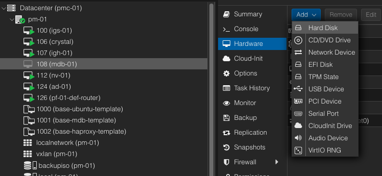
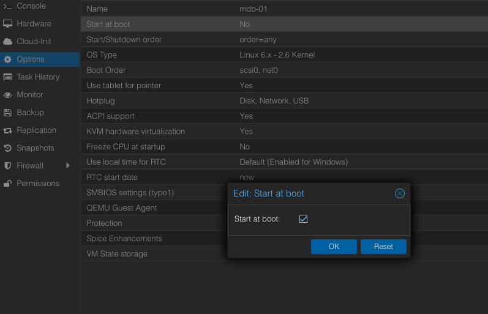
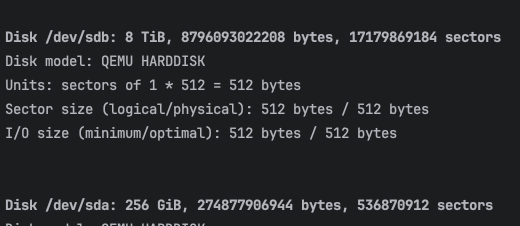
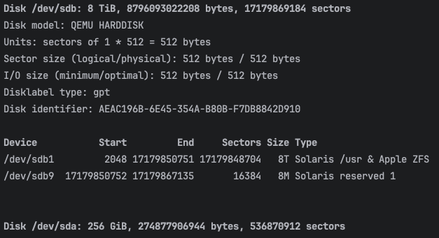
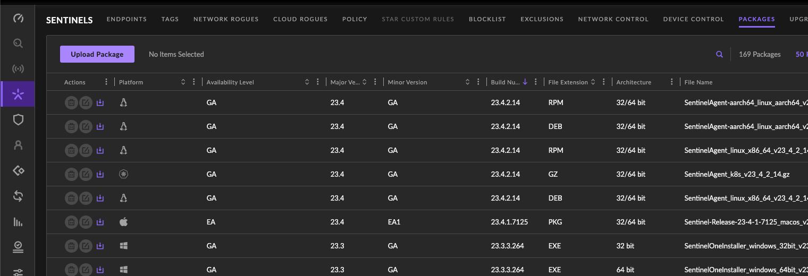
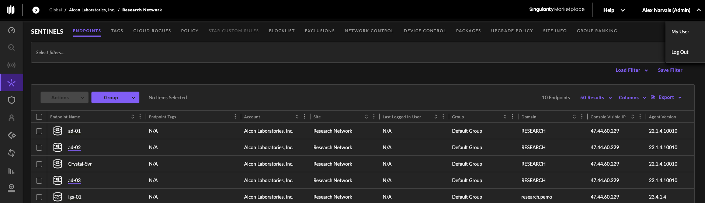

## MariaDB Backup Test Main Content Setup
___
The following virtual machine(s) will be created using the PROXMOX Hypervisor Type 1 Software.   
___
1. Access the PROXMOX Hypervisor web interface using a web browser and enter the following url in the specified format:  
    **https://Your-Servers-IP-Address:8006/** 
2. If a backup node (mdb-04) virtual machine exists, then jump to **Step 3** if not then continue 
   and create a new virtual machine using one of the following methods:  
   1. If a base MariaDB template (**base-mdb-template**) is available, then see the  
      [MariaDB Backup Node Setup](#mariadb-backup-node-setup) section, if not continue in **this section** to **Step 2.2**.   
   2. If a base Ubuntu template (**base-ubuntu-template**) is available, see the **mariadb_template** build sheet located
       on the **CNAS** then jump to **Step 2.1** in **this section**, if not continue in **this section** to **Step 2.3**.  
   3. If no base Ubuntu template is available, then see the **base-ubuntu** build sheet located on the **CNAS** then 
      return to **this section** and jump to **Step 2.2**.  
3. [MariaDB Backup File Restoration](#mariadb-backup-file-restoration) section. 
4. [Ignition Database Connection](#ignition-database-connection) section.

## MariaDB Backup Node Setup
___
1. Right click and perform a full clone of the base MariaDB template (**base-mdb-template**) and set the following settings below:  

   > Target node = pm-01 or the PROXMOX node where the MariaDB template has been created   
   > Mode = Full Clone  
   > Target Storage = Same as source   
   > Name = mdb-XX (where XX is the server number being created)   
   > Resource Pool = None   
   > Format = QEMU image format   

   > NOTE: If the virtual machine needs to be under a different PROXMOX node (pm-01, pm-02, ...pm-XX) then initiate 
     a **migration** to the necessary PROXMOX node before modifying or starting the virtual machine.  

2. Add a secondary hard disk to the MariaDB node using the **Hardware** section from the content panel:  
     
   Set the hard disk configuration settings based on the following image and ensure that the **Backup** checkbox is **false**:  
   
3. Set the **Start at boot** checkbox to **true** using the **Options** section from the content panel:  
      
4. Start the virtual machine using the **Start** button.  
5. Update and upgrade the operating system using the following commands:   
   ```shell
   sudo apt update && sudo apt upgrade -y
   ```
   **NOTE:** If prompted to select which daemon services should be restarted, then accept the default selections, 
   press the **tab** key to navigate between the selections.  
6. Update the hostname from **mdb-template** to **mdb-XX** (where XX is the server instance) using the following command:
   ```shell
   sudo nano /etc/hostname
   ```
7. Update the hosts file using the following command:  
   ```shell
   sudo nano /etc/hosts
   ```
   Overwrite the existing configuration with the following text, replace XX with the server IP address and 
   instance number:    
   ```shell
   127.0.0.1 localhost
   10.20.XX.XX mdb-XX.research.pemo mdb-XX
   10.20.1.13 ad-01.research.pemo ad-01
   10.20.5.13 ad-02.research.pemo ad-02
   10.20.3.13 ad-03.research.pemo ad-03
   ```
   See the image below for reference:  
     
   IP Address per node server should fall within the following subnets:  
   
   > mdb-01/mdb-04 - 10.20.1.XX/24 and gateway 10.20.1.1  
   > mdb-02 - 10.20.5.XX/24 and gateway 10.20.5.1  
   > mdb-03 - 10.20.3.XX/24 and gateway 10.20.3.1

8. Reset the machine ID using the following commands:
   ```shell
   sudo  rm  -f  /etc/machine-id /var/lib/dbus/machine-id
   sudo dbus-uuidgen --ensure=/etc/machine-id
   sudo dbus-uuidgen --ensure
   ```
9. Regenerate ssh keys using the following commands:
   ```shell
   sudo rm /etc/ssh/ssh_host_*
   sudo dpkg-reconfigure openssh-server
   ```
10. Change the network interface IP address from DHCP to Static by editing the **00-installer-config.yaml** file using the following command:   
    ```shell
    sudo nano /etc/netplan/00-installer-config.yaml
    ```
    Under the network interface key comment out the **dhcp4** key:value pair and then uncomment the remaining lines
    and set the network settings accordingly.  
    See the image below for reference:    
      
    **NOTE:** IP Address per node server should fall within the following subnets:

   > mdb-01/mdb-04 - 10.20.1.XX/24 and gateway 10.20.1.1  
   > mdb-02 - 10.20.5.XX/24 and gateway 10.20.5.1  
   > mdb-03 - 10.20.3.XX/24 and gateway 10.20.3.1
   
11. Restart the machine using the following command:  
    ```shell
    sudo reboot
    ```
12. Delete the MariaDB Galera Cluster configuration file using the following command:  
    ```shell
    sudo rm /etc/mysql/mariadb.conf.d/60-galera.cnf
    ```
13. Edit the MariaDB Server configuration file using the following command:  
    ```shell 
    sudo nano /etc/mysql/mariadb.conf.d/50-server.cnf
    ```
    Update the following configuration variables: 
    1. Copy and paste the existing **datadir** variable and set the copy **datadir** to the following and comment out the original:      
       ```text
       # XXXXXXXX needs to updated and is the file date of the latest backup. 
       datadir = /mdb_pool/mdb_data/galera-rsync-backup-XXXXXXXX/mdb_data
       ```
       See the image below for reference:  
            
    2.  Copy and paste the existing **bind-address** variable and set the copy **bind-address** to the following and comment out the original:  
        ```text
        bind-address = 0.0.0.0
        ```
        See the image below for reference:   
             
    3. Uncomment the **log** variables shown in the image below:  
          
    4. Add the following system variables to the bottom of **[mariadbd]** section to enable the MariaDB server audit plugin:  
         
14. Create a ZFS pool and file system using the secondary disk:   
     1. Temporarily gain superuser privileges using the command below:  
        ```shell
        sudo su
        ```
        **NOTE:** This command will prevent having to type **sudo** for every superuser command typed.  
     2. Find the secondary disk that'll be used for the creation of the ZFS file system using following command:
        ```shell
        fdisk -l
        ```
        **NOTE:** The file structure path for the secondary hard disk should look similar to **/dev/sdb**, 
                  notice no partitions are created on the disk, if any partitions were created on the secondary disk, 
                  the partitions would appear right before the next disk (**/dev/sda**) is displayed.    
        See the image below for reference:  
          
     3. Install the ZFS tools and packages using the following commands:  
        ```shell
        sudo apt install zfsutils-linux -y
        ```
     4. Create the MariaDB ZPOOL using the following command:  
        ```shell
        sudo zpool create mdb_pool /dev/sdb
        ```
        Issue the following command to verify the creation of the zpool:   
        ```shell
        sudo zpool status
        ```
     5. Create the MariaDB ZFS data file system using the following command:    
         ```shell
          sudo zfs create mdb_pool/mdb_data
         ```
         Issue the following command to verify the creation of the ZFS file system:   
         ```shell
         sudo zfs list
         ```
     6. Reboot the machine and verify the ZFS file system stays mounted using the following commands:  
        ```shell
        sudo reboot
        ```
        ```shell
        sudo df -Th
        ```
        The following image shows the new ZPOOL and ZFS (file system) on secondary disk:   
           
        ```shell
        sudo fdisk -l 
        ```
        The following image shows the new partitions on the secondary disk:  
          
15. Change the ownership and contents of the data directory recursively to the mysql user and mysql group:
    ```shell
    sudo chown -R mysql:mysql /mdb_pool/mdb_data/
    ```
16. Install the network file system packages if not already installed using the following command:   
    ```shell
    sudo apt install nfs-common -y
    ```
17. Create a directory mount point to mount the **cnas mdb-backup** share drive using the following sub steps:
    1. Create a NFS directory on the local machine to share using a similar command to the following:  
       ```shell
       sudo mkdir -p /mnt/mdb_data_backups/nas
       ```
    2. Check that the correct NFS share is available on the NFS server using the following command:  
       ```shell
       showmount -e cnas-01.research.pemo
       ```
       The following image will show the NFS shares available, from issuing the above command:  
             
    3. Mount the external NFS share on the machine using the following command:  
       ```shell
       sudo mount -t nfs cnas-01.research.pemo:/volume1/mdb-backup /mnt/mdb_data_backups/nas
       ```
    4. Allow full permissions (read, write, execute) for the owner, group and others using the following command:   
       ```shell
       sudo chmod 777 /mnt/mdb_data_backups/nas
       ```
    5. Edit the **/etc/fstab** file to automatically mount the **cnas mdb-backup** share drive using the following command:   
       ```shell
       sudo nano /etc/fstab
       ```
       Place the following text at the end of the file:   
       ```text
       cnas-01.research.pemo:/volume1/mdb-backup /mnt/mdb_data_backups/nas nfs defaults 0 0
       ```
       See the image below for reference:   
           
18. Create a directory mount point to mount the **cnas scada** share drive using the following sub steps:
    1. Create a NFS directory on the local machine to share using a similar command to the following:  
       ```shell
       sudo mkdir -p /mnt/scada/nas
       ```
    2. Check that the correct NFS share is available on the NFS server using the following command:   
       ```shell
       showmount -e cnas-01.research.pemo
       ```
       The following image will show the NFS shares available, from issuing the above command:  
           
    3. Mount the external NFS share on the machine using the following command:  
       ```shell
       sudo mount -t nfs cnas-01.research.pemo:/volume2/scada /mnt/scada/nas
       ```
    4. Allow full permissions (read, write, execute) for the owner, group and others using the following command:    
       ```shell
       sudo chmod 777 /mnt/scada/nas
       ```
    5. Edit the **/etc/fstab** file to automatically mount the **cnas scada** share drive using the following command:   
       ```shell
       sudo nano /etc/fstab
       ```
       Place the following text at the end of the file:   
       ```text
       cnas-01.research.pemo:/volume2/scada /mnt/scada/nas nfs defaults 0 0
       ```
       See the image below for reference:   
           
19. Join the MariaDB server to the Active Directory:
    1. Edit the Samba configuration file using the following command:
       ```shell 
       sudo nano /etc/samba/smb.conf
       ```
       Update the value of the variable **netbios name** to the server node name being created in the **[global]** section.    
       See the image below for reference:     
         
    2. Start and enable the **Samba** service using the following command:   
       ```shell
       sudo systemctl enable --now smbd
       ```
    3. Join the machine to active directory domain using the following command:  
       ```shell
       sudo net ads join -S AD-01.RESEARCH.PEMO -U <user_in_ad_domain>
       ```
       **NOTE:** **<user_in_ad_domain>** - is a user who has privileges in the AD domain to add a computer.  
    4. Start and enable the **winbind** service using the following command:  
       ```shell
       sudo systemctl enable --now winbind
       ```
       Verify that **winbind** service established a connection to the active directory domain by running the command below:  
       ```shell
       sudo wbinfo -u
       ```
       **NOTE:** This command will return a list of users from the domain that is connected via **winbind**.   

    5. Verify AD login acceptance into the machine by logging out and logging in with an AD account.   
       Use the following command for reference:  
       ```shell
       ssh <user_in_ad_domain>@mdb-XX.research.pemo
       ```
20. Install **SentinelOne** cybersecurity software.   

    > The following sub steps will explain how to install **SentinelOne** by using a NAS (network attached storage) 
      device, then accessing the installation files on the NAS.  
    
    1. Check that the latest **SentinelOne GA Version** is on the **scada** share drive using the following command:     
       ```shell
       ls -l /mnt/scada/nas/program_install_files/sentinel_one/
       ```
       See the image below for finding the latest packages using the **SentinelOne Web Management Console**:   
          
    
    2. Make note and verify the site token for the site that the machine will join, the site token for a site can be found using
       the following image for reference, click the site to find the site token:  
        
    3. Change directories to the location where the files and shell script are located using a similar command to the following:  
       ```shell
       cd /mnt/scada/nas/program_install_files/sentinel_one
       ```
    4. Once in the **SentinelOne** directory execute the shell script **sentinelone_linux_agent_install.sh** using the following command:  
       ```shell
       sudo ./sentinelone_linux_agent_install.sh
       ```
       **NOTE:** Ensure that the latest packages from **Step 21.1** are in the directory and that the shell script 
       contains the correct path to the latest package and site token
       (with respect to the site that the machine will join).  
       Use the following command to open the shell script, if necessary:  
       ```shell
       sudo nano sentinelone_linux_agent_install.sh
       ```
    5. Open up the **SentinelOne** web management console and verify the machine joined the Sentinels endpoint list, check the image below:  
          
21. [MariaDB Backup Test Main Content Setup](#mariadb-backup-test-main-content-setup) section.  


## MariaDB Backup File Restoration

1. Stop the MariaDB service using the following command:  
   ```shell
   sudo systemctl stop mariadb
   ```
2. Verify the MariaDB service has stopped using the following command:  
   ```shell
   sudo systemctl is-active mariadb
   ```
3. Delete all the files and directories within the **mdb_data** directory using the following command:  
   ```shell
   sudo rm -rf /mdb_pool/mdb_data/*
   ```
4. Verify all files and directories within the **mdb_data** directory have been deleted using the following command:   
   ```shell
   ls -l /mdb_pool/mdb_data/
   ```
5. Find the MariaDB latest backup tar.gz archive on the **cnas mdb-backup** share drive using the following command:  
   ```shell
   ls -l /mnt/mdb_data_backups/nas
   ```
6. Extract the contents of the MariaDB latest backup tar.gz archive into the **mdb_data** directory 
   using the following command:    
   ```shell
   sudo tar -xzvf /mnt/mdb_data_backups/nas/galera-rsync-backup-XXXXXXXX.tgz -C /mdb_pool/mdb_data/  
   ```
   > NOTE: Replace XXXXXXXX with the MariaDB latest backup tar.gz archive date

7. Change the ownership of files and directories to the user **mysql** and group **mysql** recursively using the following command:  
   ```shell
   sudo chown -R mysql:mysql /mdb_pool/mdb_data/galera-rsync-backup-XXXXXXXX/
   ```
8. Verify that the contents of the backup archive have been extracted into the **mdb_data** directory using the following command:  
   ```shell
   ls -l /mdb_pool/mdb_data/galera-rsync-backup-XXXXXXXX/mdb_data/
   ```
9. Delete the tc.log file using the following command:  
   ```shell
   sudo rm -rf /mdb_pool/mdb_data/galera-rsync-backup-XXXXXXXX/mdb_data/tc.log
   ```
10. Update the **datadir** path to the latest backup date in the MariaDB server configuration file using the following command:  
    ```shell
    sudo nano /etc/mysql/mariadb.conf.d/50-server.cnf
    ```
    See the image below for reference:   
          

11. Start the MariaDB service using the following command:  
    ```shell
    sudo systemctl start mariadb
    ```
12. Verify that the MariaDB service has started using the following command:
    ```shell
    sudo systemctl is-active mariadb
    ```
13. Issue the following SQL query to verify data is capable of being retrieved:  
    ```shell
    mariadb -u root -p -e "SHOW DATABASES;"
    ```
14. [MariaDB Backup Test Main Content Setup](#mariadb-backup-test-main-content-setup) section.

## Ignition Database Connection
1. Login into the **igs-01** ignition gateway page and establish a connection to **mdb-04** using the following sub steps:  
   1. Access the **Database Connections** page using the following path:  
      > Config\DATABASES\Connections
   2. Create a new connection and update the following fields:

      > **Name** = CVIPSS_Main_MDB04    
        **Description** = This connection is to the MariaDB Backup Node (mdb-04) under PROXMOX 4. The connection is required to run the MariaDB Backup Verification. Disable the connection when finished.    
        **Connection URL** = jdbc:mariadb://mdb-04.research.pemo:3306/cvipss_main  
        **Username** = ignition   
        **Password** = <one_extra_rich_capital_cat>   
   3. Access the **Databases Status** page and verify a valid connection using the following path:  
        > Status\CONNECTIONS\Databases
      
      See the image below for reference:    
        
2. [MariaDB Backup Test Main Content Setup](#mariadb-backup-test-main-content-setup) section.  