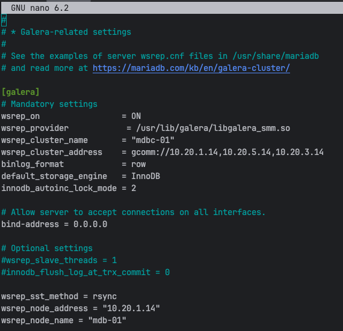

# MariaDB Server Node Main Content Steps
The following virtual machine(s) will be created using the PROXMOX Hypervisor Type 1 Software.   
___
1. Access the PROXMOX Hypervisor web interface using a web browser and enter the following url in the specified format:  
    **https://Your-Servers-IP-Address:8006/** 
2. If a base MariaDB template (**base-mdb-template**) is available, then see the 
   [MariaDB Server Node Setup](#mariadb-server-node-setup) section, if not continue in **this section** to **Step 3**.   
3. If a base Ubuntu template (**base-ubuntu-template**) is available, see the **mariadb_template** document then return 
   and jump to **Step 2** in **this section**, if not continue in **this section** to **Step 4**.  
4. If no base Ubuntu template is available, then see the **base-ubuntu** build sheet then return to
   **this section** and jump to **Step 3**.  
5. Jump to the [Galera Cluster Setup](#galera-cluster-setup) section. 
6. Jump to the [Galera Arbitrator Setup](#galera-arbitrator-setup) section.
7. Jump to the [MariaDB Backup Node Setup](#mariadb-backup-node-setup) section.  
8. Create the MariaDB HAProxy servers using the **mariadb_haproxy** document. 

## MariaDB Server Node Setup 
___
1. Right click and perform a full clone of the base MariaDB template (**base-mdb-template**) and set the following settings below:  

   > Mode = Full Clone  
   > Target Storage = Same as source  
   > Name = mdb-XX (where XX is the server number being created)  
   > Resource Pool = None  
   > Format = QEMU image format  

   > If the virtual machine needs to be under a different PROXMOX node (pm-01, pm-02, ...pm-XX) then initiate a **migration** 
     to the necessary PROXMOX node before modifying or starting the virtual machine.  

2. Add a secondary hard disk to the MariaDB node using the **Hardware** section from the content panel:  
     
   Set the hard disk configuration settings based on the following image and ensure that the **Backup** checkbox is **false**:  
   
3. Set the **Start at boot** checkbox to **true** using the **Options** section from the content panel:  
      
4. Start the virtual machine using the **Start** button.  
5. Update and upgrade the operating system using the following commands:   
   ```shell
   sudo apt update && sudo apt upgrade -y
   ```
   **NOTE:** If prompted to select which daemon services should be restarted, then accept the default selections, 
   press the **tab** key to navigate between the selections.  
6. Update the hostname from **mdb-template** to **mdb-XX** (where XX is the server instance) using the following command:
   ```shell
   sudo nano /etc/hostname
   ```
7. Update the hosts file using the following command:  
   ```shell
   sudo nano /etc/hosts
   ```
   Overwrite the existing configuration with the following text, replace XX with the server IP address and 
   instance number:    
   ```shell
   127.0.0.1 localhost
   10.20.XX.XX mdb-XX.research.pemo mdb-XX
   10.20.1.13 ad-01.research.pemo ad-01
   10.20.5.13 ad-02.research.pemo ad-02
   10.20.3.13 ad-03.research.pemo ad-03
   ```
   See image below for reference:  
     
   IP Address per node server should fall within the following subnets:  
   
   > mdb-01 - 10.20.1.14/24 and gateway 10.20.1.1  
   > mdb-02 - 10.20.5.14/24 and gateway 10.20.5.1  
   > mdb-03 - 10.20.3.14/24 and gateway 10.20.3.1  

8. Reset the machine ID using the following commands:
   ```shell
   sudo  rm  -f  /etc/machine-id /var/lib/dbus/machine-id
   sudo dbus-uuidgen --ensure=/etc/machine-id
   sudo dbus-uuidgen --ensure
   ```
9. Regenerate ssh keys using the following commands:
   ```shell
   sudo rm /etc/ssh/ssh_host_*
   sudo dpkg-reconfigure openssh-server
   ```
10. Change the network interface IP address from DHCP to Static by editing the **00-installer-config.yaml** file using the following command:   
     ```shell
     sudo nano /etc/netplan/00-installer-config.yaml
     ```
    Under the network interface key comment out the **dhcp4** key:value pair and then uncomment the remaining lines
    and set the network settings accordingly.  
    See the image below for reference:    
      
    **NOTE:** IP Address per node server should fall within the following subnets:
   
    > mdb-01 - 10.20.1.14/24 and gateway 10.20.1.1  
    > mdb-02 - 10.20.5.14/24 and gateway 10.20.5.1  
    > mdb-03 - 10.20.3.14/24 and gateway 10.20.3.1  
   
11. Restart the machine using the following command:  
    ```shell
    sudo reboot
    ```
12. Edit MariaDB with Galera cluster configuration file using the command below: 
    ```shell
    sudo nano /etc/mysql/mariadb.conf.d/60-galera.cnf
    ```
    Uncomment the necessary lines and update the required parameters with respect to the server being created.  
    See the image below for reference:  
      
    The following parameter that'll be the same and different across each server node configuration file:  
    ```ini
    wsrep_cluster_name = "mdbc-01" # The value should be the same in all server node configuration files part of the same cluster
    wsrep_node_address = "10.20.X.X" # This will be updated per server node being created
    wsrep_node_name = "mdb-xx" # This will be updated per server node being created.
    ```
13. Edit the MariaDB server configuration file **/etc/mysql/mariadb.conf.d/50-server.cnf** using the following command:  
    ```shell 
    sudo nano /etc/mysql/mariadb.conf.d/50-server.cnf
    ```
    Uncomment and set **datadir = /mdb_pool/mdb_data** in the top **[mariadbd]** section, as in the image below:  
      
    Uncomment the various error log variables as in the image below:  
      
    Add the following system variables to the bottom of **[mariadbd]** section to enable the MariaDB server audit plugin:  
    
14. Create a ZFS pool and file system using the secondary disk:
     1. Temporarily gain superuser privileges using the command below:  
        ```shell
        sudo su
        ```
        **NOTE:** This command will prevent having to type **sudo** for every superuser command typed.  
     2. Find the secondary disk that'll be used for the creation of the ZFS file system using following command:
        ```shell
        fdisk -l
        ```
        **NOTE:** The file structure path for the secondary hard disk should look similar to **/dev/sdb**, 
                  notice no partitions are created on the disk, if any partitions were created on the secondary disk, 
                  the partitions would appear right before the next disk (**/dev/sda**) is displayed.    
        See the image below for reference:  
          
     3. Install the ZFS tools and packages using the following commands:  
        ```shell
        sudo apt install zfsutils-linux -y
        ```
     4. Create the MariaDB ZPOOL using the following command:  
        ```shell
        sudo zpool create mdb_pool /dev/sdb
        ```
        Issue the following command to verify the creation of the zpool:   
        ```shell
        sudo zpool status
        ```
     5. Create the MariaDB ZFS data file system using the following command:    
         ```shell
          sudo zfs create mdb_pool/mdb_data
         ```
         Issue the following command to verify the creation of the ZFS file system:   
         ```shell
         sudo zfs list
         ```
     6. Reboot the machine and verify the ZFS file system stays mounted using the following commands:  
        ```shell
        sudo reboot
        ```
        ```shell
        sudo df -Th
        ```
        The following image shows the new ZPOOL and ZFS (file system) on secondary disk:   
           
        ```shell
        sudo fdisk -l 
        ```
        The following image shows the new partitions on the secondary disk:  
          
15. Change the ownership and contents of the data directory recursively to the mysql user and mysql group:
    ```shell
    sudo chown -R mysql:mysql /mdb_pool/mdb_data/
    ```
16. Copy everything from **/var/lib/mysql/** directory to the data directory recursively while preserving the file attributes using the command below:
    ```shell
    sudo cp -R -p /var/lib/mysql/* /mdb_pool/mdb_data/
    ```
17. Initialize the galera custer, which also starts the MariaDB service, using the following command:  
    ```shell 
    sudo galera_new_cluster
    ```
    The status of the MariaDB service can be checked using the following command:  
    ```shell 
    sudo systemctl is-active mariadb.service
    ```
18. Verify that **datadir** system variable holds the new path to the data directory using the command:
    ```shell
    mariadb -u root -p -e "SELECT @@datadir"
    ```
    Output should look like the image below:  
      
19. Stop the MariaDB service using the following command:
    ```shell 
    sudo systemctl stop mariadb.service
    ```
20. Join the MariaDB server to the Active Directory:
    1. Edit the Samba configuration file using the following command:
       ```shell 
       sudo nano /etc/samba/smb.conf
       ```
       Update the value of the variable **netbios name** to the server node name being created in the **[global]** section. This 
       should be the only variable that needs to be updated across each server node configuration file. See the image
       below for clarification:  
         
    2. Start and enable the **Samba** service using the following command:   
       ```shell
       sudo systemctl enable --now smbd
       ```
    3. Join the machine to active directory domain using the following command:  
       ```shell
       sudo net ads join -S AD-01.RESEARCH.PEMO -U <user_in_ad_domain>
       ```
       **NOTE:** **<user_in_ad_domain>** - is a user who has privileges in the AD domain to add a computer.  
    4. Start and enable the **winbind** service using the following command:  
       ```shell
       sudo systemctl enable --now winbind
       ```
       Verify that **winbind** service established a connection to the active directory domain by running the command below:  
       ```shell
       sudo wbinfo -u
       ```
       **NOTE:** This command will return a list of users from the domain that is connected via **winbind**.   

    5. Verify AD login acceptance into the machine by logging out and logging in with an AD account.   
       Use the following command for reference:  
       ```shell
       ssh <user_in_ad_domain>@mdb-XX.research.pemo
       ```
21. Install **SentinelOne** cybersecurity software.   

    > The following sub steps will explain how to install **SentinelOne** by using a NAS (network attached storage) 
      device, then accessing the installation files on the NAS.  
    
    1. Check that the latest **SentinelOne GA Version** is on the **scada** share drive using the following path:   
       
       > /Volumes/scada/program_install_files/sentinel_one  
      
       See the image below for finding the latest packages using the **SentinelOne Web Management Console**:   
          
    
    2. Make note and verify the site token for the site that the machine will join, the site token for a site can be found using
       the following image for reference, click the site to find the site token:  
          
    3. Install the network file system packages if not already installed using the following command:   
       ```shell
       sudo apt install nfs-common -y
       ```
    4. Create a NFS directory on the local machine to share using a similar command to the following:  
       ```shell
       sudo mkdir -p /mnt/scada/nas
       ```
    5. Check that the correct NFS share is available on the NFS server using a similar command to the following:  
       ```shell
       showmount -e cnas-01.research.pemo
       ```
       The following image will show the NFS shares available, from issuing the above command:  
          
       **NOTE:** If the NFS share is not available, then check the following on the NAS:   
       1.  Ensure the share folder is created.
       2. Check the location of the share folder.
       3. Check the NFS permission rules.

    6. Mount the external NFS share on machine using a similar command to the following:  
       ```shell
       sudo mount -t nfs cnas-01.research.pemo:/volume1/scada /mnt/scada/nas
       ```
    7. Allow full permissions (read, write, execute) for the owner, group and others using a similar command to the following:  
       ```shell
       sudo chmod 777 /mnt/scada/nas
       ```
    8. Change directories to the location where the files and shell script are located using a similar command to the following:  
       ```shell
       cd /mnt/scada/nas/program_install_files/sentinel_one
       ```
    9. Once in the **SentinelOne** directory execute the shell script **sentinelone_linux_agent_install.sh** using the following command:  
       ```shell
       sudo ./sentinelone_linux_agent_install.sh
       ```
       **NOTE:** Ensure that the latest packages from **Step 21.1** are in the directory and that the shell script 
       contains the correct path to the latest package and site token
       (with respect to the site that the machine will join).  
       Use the following command to open the shell script, if necessary:  
       ```shell
       sudo nano sentinelone_linux_agent_install.sh
       ```
    10. Open up the **SentinelOne** web management console and verify the machine joined the Sentinels endpoint list, check the image below:  
          
22. Repeat **Steps 1–21** above, for every MariaDB server node instance.  
23. Jump to **Step 5** in the [MariaDB Server Node Main Content Setup](#mariadb-server-node-main-content-steps) section.  

## Galera Cluster Setup
Start the Galera Cluster by bootstrapping a server node (**mdb-01**), which makes the node the primary component 
from which the other nodes in the cluster can sync. The MariaDB service should be stopped on every node that'll 
join the cluster. The initialization of the cluster can technically be started on any server node available, 
but typically the start of the cluster will be initialized from the first node (**mdb-01**).
___
1. Bootstrap **mdb-01** to form the new cluster using the following command:   
   ```shell
   sudo galera_new_cluster
   ```
   **NOTE:** This will also automatically start the MariaDB service on **mdb-01**.  
2. Start and enable the MariaDB service on the other MariaDB server nodes using the following command:
   ```shell
   sudo systemctl enable --now mariadb
   ```
3. Verify the status and health of the MariaDB Galera Cluster using the following SQL queries:  
   Check the cluster size:  
   ```shell
   mariadb -u root -p -e "SHOW STATUS LIKE 'wsrep_cluster_size'"
   ```
   Output should look similar to the image below:  
     
   Check all the incoming node addresses (IP and port) that are part of the cluster:  
   ```shell
   mariadb -u root -p -e "SHOW STATUS LIKE 'wsrep_incoming_addresses'"  
   ```
   Output should look similar to the image below:  
     
   **NOTE:** The commands above can be executed from any server node that has successfully joined the cluster.  
4. Jump to **Step 6** in the [MariaDB Server Node Main Content Setup](#mariadb-server-node-main-content-steps) section.   

## Galera Arbitrator Setup
This only needs to be configured on one of the server nodes, **mdb-03** will be selected since it's the odd number node, and the donor node. 
___
1. Install Galera Arbitrator package using the following command:  
   ```shell
    sudo apt install galera-arbitrator-4
   ```
2. Create the Galera Arbitrator configuration file using the following command:
   ```shell
    sudo nano /etc/garbd.cnf
   ```
   Paste the text into the configuration file:
    ```ini
    # Galera Arbitrator Configuration File
    # ___
    # group - set to the same value as the wsrep_cluster_name variable in the /etc/mysql/mariadb.conf.d/60-galera.cnf file.
    # address - set to the same value as the wsrep_cluster_address variable in the /etc/mysql/mariadb.conf.d/60-galera.cnf file.
    # sst - state transfer is when a node connects to another node in the cluster and attempts to bring its local database back 
    # in sync with the cluster, and in a state snapshot transfer (sst) the donor uses a backup solution
    # to copy its data directory to the joiner. When joiner completes the sst, it begins to process the write-sets that came in 
    # during the transfer. Once it's in sync with the cluster, the cluster becomes operational again.
    # donor - the node that'll use its local database to bring another nodes databases back in sync with the cluster.
    # joiner - the node whose local database is out of sync with the other nodes in the cluster. 

    group="mdbc-01"
    address="gcomm://10.20.1.14:4567,10.20.5.14:4567,10.20.3.14:4567"
    options="gmcast.listen_addr=tcp://0.0.0.0:4444"
    donor="mdb-03"
    sst="backup_rsync"
    log="/var/log/garbd.log"
    ```
3. Create the **State Snapshot Transfer Backup Script** using the following command:
   ```shell
    sudo nano /usr/bin/wsrep_sst_backup_rsync
   ```
   Paste the text into the configuration file:
    ```shell
    #!/bin/bash
    # shebang (#!) at the top of the script to know which interpreter to use.
    
    # usage: garbd --cfg /etc/garbd.cnf
    # garbd.cnf must specify the sst as backup_rsync
    
    backup_dir='/mdb_pool/mdb_backup'
    backup_sub_dir='rsync_files'
   
    today=`date +"%Y%m%d"`
    backup_today="galera-rsync-backup-$today"
    
    last_week=$(date -d "$date -7 days" +"%Y%m%d")
    backup_last_week="galera-rsync-backup-$last_week.tgz"
   
    # Load common script
    /usr/bin/wsrep_sst_common
   
    # Copy MariaDB data to temporary directory
    rsync -a /mdb_pool/mdb_data $backup_dir/$backup_sub_dir
   
    # Archive the data directory
    cd $backup_dir/$backup_sub_dir
    tar -czf $backup_dir/$backup_today.tgz * --transform "s,^,$backup_today/,"
   
    # Copy the file to the nas 
    cp $backup_dir/$backup_today.tgz /mnt/mdb_data_backups/nas
   
    # Delete last weeks archive
    rm -f $backup_dir/$backup_last_week  
    ```
4. Make the file an executable using the following command:  
    ```shell
    sudo chmod +x /usr/bin/wsrep_sst_backup_rsync
    ```
5. Create the MariaDB ZFS backup file system using the following command:    
    ```shell
     sudo zfs create mdb_pool/mdb_backup
    ```
    Issue the following command to verify the creation of the ZFS file system:   
    ```shell
    sudo zfs list
    ```
   Allow full permissions (read, write, execute) for the owner, group and others.
   ```shell
    sudo chmod 777 /mdb_pool/mdb_backup
   ```
   Change the owner of the directory to a user named **mysql** in the **mysql** group.
   ```shell
    sudo chown mysql:mysql /mdb_pool/mdb_backup
   ```
6. Create a network file system (NFS) on the NAS (cnas-01.research.pemo) and give **mdb-03** access:  
   1. Create a NFS directory on **mdb-03** to share using the following commands:
      1. Make a MariaDB backup share directory. 
         ```shell
         sudo mkdir -p /mnt/mdb_data_backups/nas
         ```
      2. Allow full permissions (read, write, execute) for the owner, group and others.
         ```shell
         sudo chmod 777 /mnt/mdb_data_backups/nas
         ```
      3. Change the owner of the directory to a user named **mysql** in the **mysql** group.
         ```shell
         sudo chown mysql:mysql /mnt/mdb_data_backups/nas
         ```
   2. Create the backup directory on the NAS using the web interface.
      1. Open a web browser and enter the url [http://cnas-01.research.pemo:5000/](http://cnas-01.research.pemo:5000/).  
      2. Open the **Control Panel/Share** folder, create a new share folder with the name **mdb-backup** and 
         set the new share folder with the following settings:  
         1. General Tab:  
              
         2. Access the **NFS Permissions** tab and allow permission from the following client IP addresses:  
                
         **NOTE**: Encryption, Advanced, Permissions, and Advanced Permissions tabs can be left at the default settings.  
   3. Install the NFS common packages on mdb-03 using the following command:  
      ```shell
      sudo apt install nfs-common
      ```
   4. Mount the cnas-01 (external NFS share) on mdb-03 (local system) using the following command:
      ```shell
      sudo mount -t nfs cnas-01.research.pemo:/volume1/mdb-backup /mnt/mdb_data_backups/nas
      ```
      Verify the mount using the **df** command to display the filesystem type in a human-readable format.
      ```shell
      sudo df -Th
      ```
   5. Edit the file system table configuration file using the command below:   
      ```shell 
      sudo nano /etc/fstab
      ```
      Add the following text to the end of the file:  
      ```shell
      cnas-01.research.pemo:/volume1/mdb-backup /mnt/mdb_data_backups/nas nfs defaults 0 0  
      ```
      See the image below for reference:   
         
   6. Reboot the machine and verify the mount stays attached using the **df** command:
      ```shell
      sudo df -Th
      ```
7. Test the **garbd** (Galera Arbitrator Daemon) configuration file using the following commands. 
   1. Run the script:   
      ```shell 
      sudo garbd --cfg /etc/garbd.cnf
      ```
   2. Check that a MariaDB backup exists on the CNAS-01 share:   
      ```shell 
      sudo ls -sh /mnt/mdb_data_backups/nas/
      ```
   3. Check that a MariaDB backup exists on local MariaDB ZFS:  
      ```shell 
      sudo ls -sh /mdb_pool/mdb_backup/
      ```
   4. Remove the backups from the CNAS-01 share after testing and verification:  
      ```shell 
      sudo rm -rf /mnt/mdb_data_backups/nas/*
      ```
   5. Remove the backups from the local MariaDB ZFS after testing and verification:  
      ```shell
      sudo rm -rf /mdb_pool/mdb_backup/*
      ```
8. Edit the crontab file using the following command:  
   ```shell
   sudo nano /etc/crontab
   ```   
   Place the following text at the end of the file to schedule the **garbd** configuration file 
   to run automatically at a specified time:   
   ```shell
   7 7 * * * root garbd --cfg /etc/garbd.cnf
   ```
   The crontab expression above (`7 7 * * *`) is as followed from left to right:  
     - minute (0-59) 
     - hour (0-23) 
     - day of month (1-31) 
     - month (1-12)
     - day of the week (0-7)
     - \* is a wildcard that stands for **any**
     - The expression runs at 7:07 AM every day   

   **NOTE:** **root** indicates the user that the cron job should be run as and 
             **garbd --cfg /etc/garbd.cnf** starts the galera arbitrator daemon with 
             the **garbd.cnf** configuration file.  
   
   Check the image below on how the text should be placed in the crontab file:  
     
   Restart the **cron** service using the command below:  
   ```shell
   sudo systemctl restart cron
   ```
9. Jump to **Step 7** in the [MariaDB Server Node Main Content Setup](#mariadb-server-node-main-content-steps) section.  

## MariaDB Backup Node Setup
___
1. Jump to **Step 8** in the [MariaDB Server Node Main Content Setup](#mariadb-server-node-main-content-steps) section.
