# EMQX HAProxy Main Content Steps
The following virtual machine(s) will be created using the PROXMOX Hypervisor Type 1 Software.   
Ensure that there exist a functional EMQX cluster before creating the HAProxy Load Balancers.  
HAProxy is a software package that can be installed on Linux flavored operating systems which 
in turn allows the OS to act as a reverse proxy and load balancer.  

> **Reverse Proxy** - sits in front of your server and accepts request from clients on its behalf.   
> **Load Balancer** - will split incoming requests among a cluster of servers, keeps track of which server got the 
                      last request, and the server that should get the next request utilizing the cluster equally. 

___
1. Access the Proxmox hypervisor web interface using a web browser and enter the following url in the specified format:  
    [https://PROXMOX-IP-Address:8006/ ](https://PROXMOX-IP-Address:8006/)
2. If a base haproxy template (**base-haproxy-template**) is available, then see the
   [EMQX HAProxy Server Node Setup](#emqx-haproxy-server-node-setup) section, if not continue to **Step 3** in **this section**.
3. If a base ubuntu template (**base-ubuntu-template**) is available see the **haproxy_template** document then return 
   and jump to **Step 2** in **this section**, if not continue in **this section** to **Step 4**.
4. If no base Ubuntu template is available, then see the **base-ubuntu** build sheet
   then return to **this section** and jump to **step 3**.  
5. Steps Complete. 

## EMQX HAProxy Server Node Setup
___
1. Right-click and perform a full clone of the base haproxy template (**base-haproxy-template**) and set the following settings below:  

   > Mode = **Full Clone**  
   > Target Storage = **Same as source**  
   > Name = **emqh-XX** (where XX is the server instance)  
   > All Other Settings = **Default**

   **NOTE**: If the virtual machine needs to be under a different PROXMOX node (pm-01, pm-02, ...pm-XX), 
   then initiate a **migration** to the necessary PROXMOX node before modifying or starting the virtual machine.  

2. Update the VM configuration settings by accessing the VM management interface and selecting on the VM:  
   1. **Hardware Settings:**  
      1. **Memory:**  
         > Memory (MiB) = **4096**   
           Minimum memory (MiB) = **1024**   
           Ballooning Device = **True**   
           All Other Settings = **Default**  
      
         See the image below for modifying the **Hardware Memory** settings:   
         !      
   
      2. **Processors:**  
         > Sockets = **2**   
           Cores = **2**      
           All Other Settings = **Default**  

         See the image below for modifying the **Hardware Processor** settings:  
         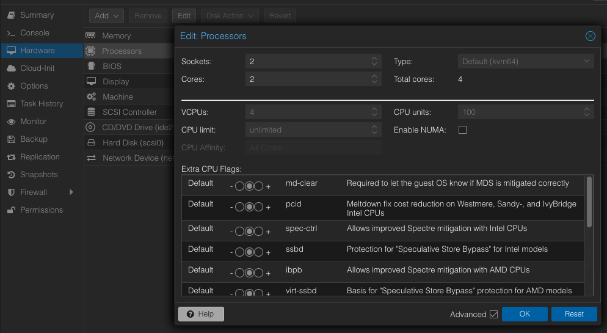   
   
   2. **Options Settings**:      
      1. **QEMU Guest Agent:**   
         > Use QEMU Guest Agent  = **True**  
           All other parameters = **Default**    
       
         See the image below for modifying the **Option QEMU Guest Agent** settings:    
         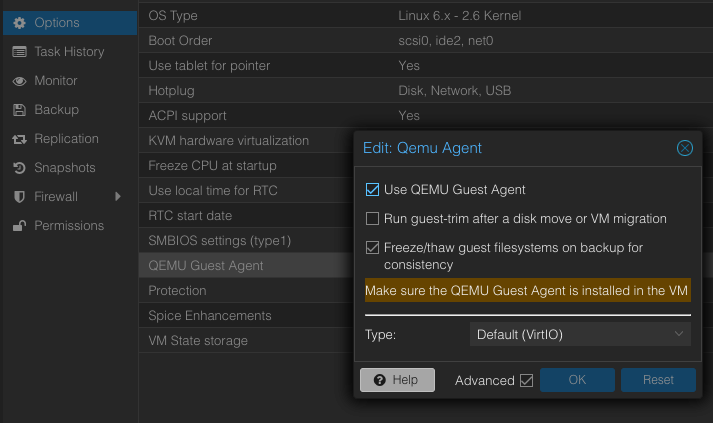   

      2. **Start at boot:**   
         > Start at boot = **True**   
      
         See the image below for modifying the **Option Start At Boot** settings:    
         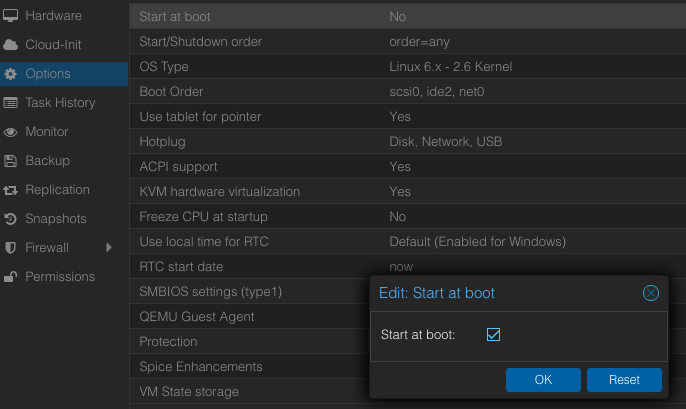   
 
3. Start the virtual machine using the **Start** button.  
4. Update and upgrade the operating system using the following commands:   
   ```shell
   sudo apt update && sudo apt upgrade -y
   ```
   **NOTE:** If prompted to select which daemon services should be restarted, then accept the default selections, 
   press the **tab** key to navigate between the selections. 
5. Update the hostname from **base-haproxy** to **emqh-XX** (where XX is the server instance) using the following command:
   ```shell
   sudo nano /etc/hostname
   ```
6. Update the hosts file using the following command:  
   ```shell
   sudo nano /etc/hosts
   ```
   Overwrite the existing configuration with the following text, replace XX with the server IP address and 
   instance number:    
   ```shell
   127.0.0.1 localhost
   10.20.XX.XX emqh-XX.research.pemo emqh-XX
   10.20.1.13 ad-01.research.pemo ad-01
   10.20.5.13 ad-02.research.pemo ad-02
   10.20.3.13 ad-03.research.pemo ad-03
   ```
   See the image below for reference:   
   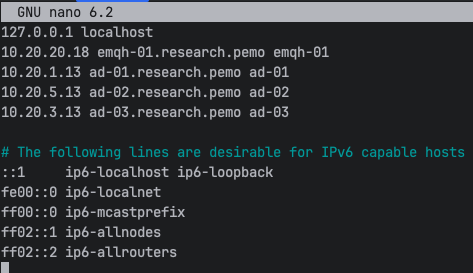  
   **NOTE:** IP Address per node server should fall within the following subnets:  
   
   > emqh-01 - 10.20.20.18/24 and gateway 10.20.20.1  
   > emqh-02 - 10.20.20.19/24 and gateway 10.20.20.1
   
7. Change the network interface IP address from **DHCP** to **Static** by editing the **00-installer-config.yaml** 
   file, using the following command:   
    ```shell
    sudo nano /etc/netplan/00-installer-config.yaml
    ```
    See the image below for reference:   
   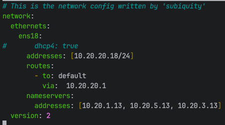  
   **NOTE:** IP Address per node server should fall within the following subnets:  
   
   > emqh-01 - 10.20.20.18/24 and gateway 10.20.20.1  
   > emqh-02 - 10.20.20.19/24 and gateway 10.20.20.1
   
8. Reset the machine ID using the following commands:
   ```shell
   sudo  rm  -f  /etc/machine-id /var/lib/dbus/machine-id
   sudo dbus-uuidgen --ensure=/etc/machine-id
   sudo dbus-uuidgen --ensure
   ```
9. Regenerate ssh keys using the following commands:
   ```shell
   sudo rm /etc/ssh/ssh_host_*
   sudo dpkg-reconfigure openssh-server
   ```
10. Reboot the machine using the following command:  
    ```shell
    sudo reboot
    ```  
11. Edit the **Network Device** from the **Hardware** settings of the VM, and assign **VLAN Tag** 20, as in the image below:  
    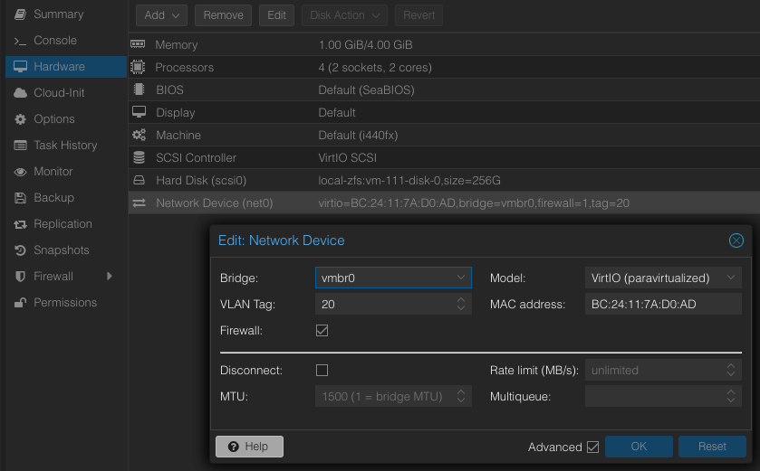  
12. Allow incoming connections on the following ports, using the following commands:  
    1. **EMQX ports :**
       ```shell
       sudo ufw allow 80/tcp
       sudo ufw allow 443/tcp
       sudo ufw allow 1883/tcp
       sudo ufw allow 8080/tcp
       sudo ufw allow 8083/tcp
       sudo ufw allow 8084/tcp
       sudo ufw allow 8404/tcp
       ```
    2. On **emqh-01**, allow traffic from **emqh-02 (10.20.20.19)** using the following command:   
       ```shell
       sudo ufw allow from 10.20.20.19
       ```
    3. On **emqh-02**, allow traffic from **emqh-01 (10.20.20.18)** using the following command:   
       ```shell
       sudo ufw allow from 10.20.20.18
       ```
    4. Verify the firewall rules were accepted using the following command:  
       ```shell
       sudo ufw status numbered
       ```
    **NOTE**: Delete a rule by issuing the following command:   
    ```shell
    sudo ufw delete <firewall_rule_number_from_issuing_command_in_step_13.4_above>
    ```
13. Update the **keepalived** file for load balancing and high-availability using the following command:  
    ```shell
    sudo nano /etc/keepalived/keepalived.conf
    ```
    Overwrite the existing configuration or update the parameters with the following configuration.  
    ```shell
    global_defs {
        # Enable script security to run "check_haproxy" script and prevent unauthorized scripts from being executed.
        enable_script_security
    }

    # Define a health check script that "Keepalived" will run periodically to monitor the health of the service.
    vrrp_script check_haproxy {
            # Command that the VRRP script will execute to check the health of the service.
            # Sends 0 to any haproxy process which checks if it's possible to send signals to the process, effectively checking if the process is running.
            script "/usr/bin/sudo /usr/bin/killall -0 haproxy"
            # Determines how often in seconds the script will run.
            interval 2
            # Determines the weight that'll be subtracted from the priority of the VRRP instance. If haproxy isn't running, 
            # then 2 will be subtracted from the priority which will cause a fail over to the other VRRP instance.
            weight 2
    }

    # Virtual interface
    vrrp_instance VI_01 {
            # The state of the node is either MASTER or BACKUP, uncomment only one of state parameters.
            state MASTER
            #state BACKUP
            interface ens18
            # Use the last octet of the shared virtual ip address to set the "virtual_router_id" parameter.
            virtual_router_id 17
            # The "priority" parameter specifies the order in which the assigned interface will take over in case of a fail over.
            # Higher "priority" parameter value sets the node as MASTER and the other as BACKUP, uncomment only one of the "priority" parameters.
            priority 101
            #priority 100

            # The virtual ip address shared between the load balancers.
            # This will change per MASTER/BACKUP pair.
            virtual_ipaddress {
                    10.20.20.17
            }

            # Associate the health check script "check_haproxy" with the VRRP instance.
            track_script {
                     check_haproxy
            }
    }
    ```
    See the image below for reference:   
    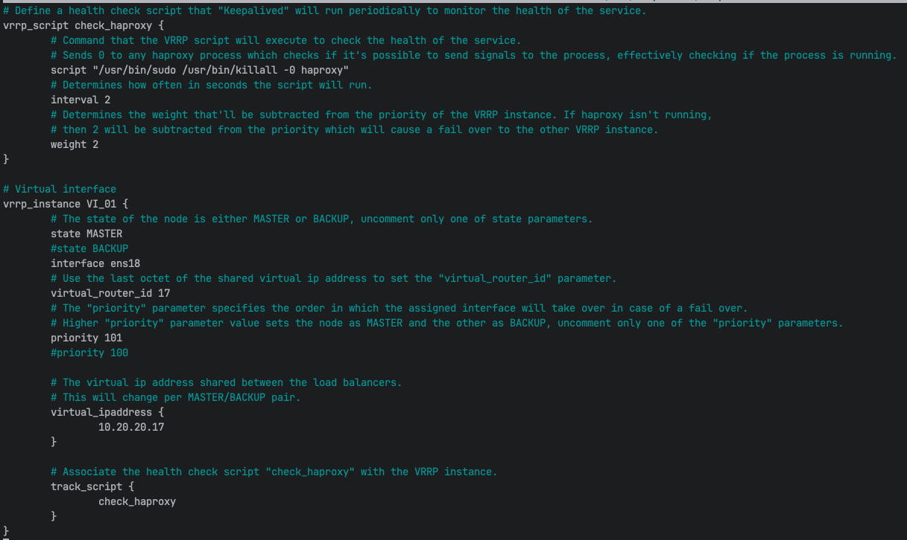   
    
    **NOTE**: The following parameters will change per **MASTER/BACKUP** pair:  

    > **state** - If one node is the **MASTER**, the other will be the **BACKUP**.  
      **interface** - Check the interface name being used.   
      **virtual_router_id** - Use the last octet of the virtual IP address.  
      **priority** - If one node is **MASTER (101)**, the other will be the **BACKUP (100)**,
      the node with the higher priority value will be the **MASTER**.  
      **virtual_ip_address** - Check the available IP network reserved for virtual routers.  
   
14. Update the **haproxy** file for load balancing and high-availability using the following command:   
    ```shell
    sudo nano /etc/haproxy/haproxy.cfg
    ```
    Placing the following text at the end of the file:  
    ```shell
    # Enable two instances of the stats webpage for display, monitoring, and health status.
    frontend stats
            mode http
            # The shared virtual IP and port number that'll be used to access the stats web page. 
            bind 10.20.20.17:8404
            # The MASTER/BACKUP IP address and port number used to create another instance of the stats web server 
            # to allow a haproxy load balancer listen section to be created and displayed on the stats web page 
            # that'll show the health status of the haproxy load balancers. 
            
            # Only uncomment one bind parameter that's based on the server for which the configuration is being configured for. 
            bind 10.20.20.18:10404
            #bind 10.20.20.19:10404
            stats enable
            stats uri /stats
            stats refresh 10s
            stats admin if LOCALHOST
    
    # The shared virtual IP and port number that's used to check the health status of the haproxy load balancers.
    listen emqx_load_balancers
          bind 10.20.20.17:10404 transparent
          balance source
          server emqh-01 10.20.20.18:10404 check
          server emqh-02 10.20.20.19:10404 check
    
    frontend emqx_management_frontend
            mode http
            bind 10.20.20.17:80 transparent
            bind 10.20.20.17:443 transparent
            http-request set-header X-Forwarded-Proto http
            default_backend emqx_management_backend
    
    backend emqx_management_backend
           mode http
           balance leastconn
           option httpchk
           option forwardfor
           cookie emq-management-backend-cookie insert
           server emq-01-m 10.20.1.18:18083 cookie emq-01-m-cookie check
           server emq-02-m 10.20.5.18:18083 cookie emq-02-m-cookie check
           server emq-03-m 10.20.3.18:18083 cookie emq-03-m-cookie check
    
    frontend emqx_frontend
        bind 10.20.20.17:1883 transparent
        mode tcp
        maxconn 50000
        #  timeout client 600s
        default_backend emqx_backend
    
    backend emqx_backend
       mode tcp
       balance source
       option tcpka
       server emq-01 10.20.1.18:1883 check send-proxy-v2 inter 10000 fall 2 rise 5 weight 1
       server emq-02 10.20.5.18:1883 check send-proxy-v2 inter 10000 fall 2 rise 5 weight 1
       server emq-03 10.20.3.18:1883 check send-proxy-v2 inter 10000 fall 2 rise 5 weight 1
    ```
15. Enable and start the **keepalived** and **haproxy** services using the following commands. 
    1. **keepalived** service:  
       ```shell
       sudo systemctl enable --now keepalived
       ```
       Check the status of service using the following command:  
       ```shell
       sudo systemctl is-active keepalived
       ```
    2. **haproxy** service:  
       ```shell
       sudo systemctl enable --now haproxy
       ```
       Check the status of service using the following command:  
       ```shell
       sudo systemctl is-active haproxy
       ```
16. You can verify the state of each Keepalived service by examining the Keepalived logs on each EMQX HAProxy node:  
    ```shell
    sudo grep "Keepalived" /var/log/syslog
    ```
    **NOTE:** This command will go through the 'syslog' file, line by line, and print out any lines that contain 
    the word "Keepalived".     
    See the image below for reference:   
    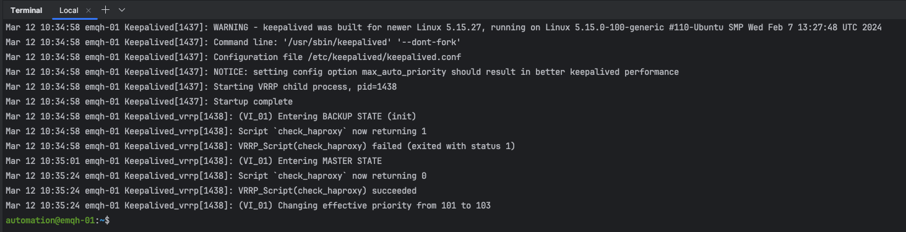  
17. Open a web browser and type the url [http://10.20.20.17:8404/stats](http://10.20.20.17:8404/stats)
    to access the HAProxy stats web page.  
    If all the EMQX and HAproxy servers are operating correctly,
    then frontend, backend and listen tables will be displayed, where each row corresponds to a server and 
    the color green indicates the server is active and up.  
    A legend is displayed that'll the row color scheme, see the image below:   
    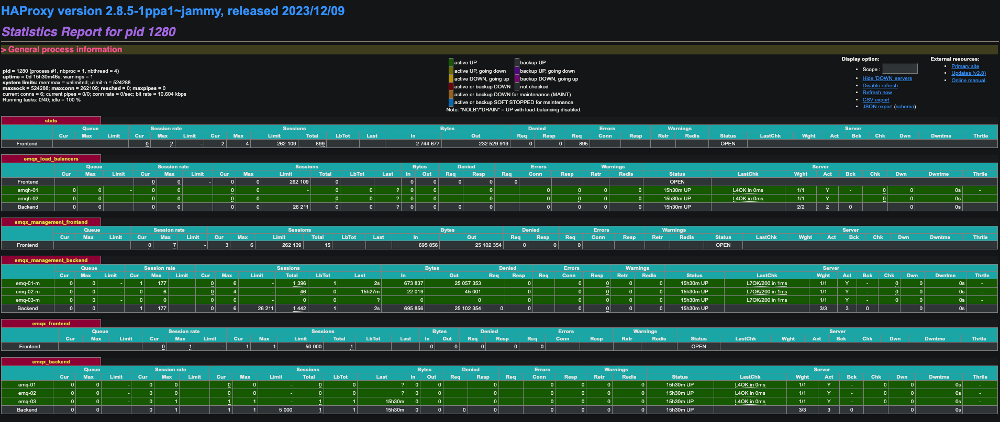  
18. Access AD-01 and bind the virtual IP to the hostname **emqx.research.pemo** using the following steps:  
    1. Open the **DNS** tools from the **Microsoft Server Manager**, see the image below:   
       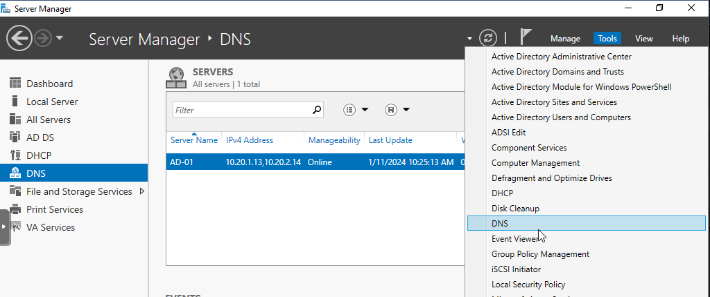  
    2. Create a new host in the **research.pemo** domain under the **Foward Lookup Zones**, see the image below:  
       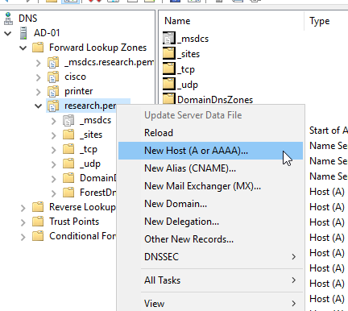  
    3. Bind a new hostname to the virtual IP, see the image below:  
         
19. Open a web browser and type the url [http://emqx.research.pemo:8404/stats](http://emqx.research.pemo:8404/stats) 
    to verify the binding of the new hostname and virtual IP.  
20. Join the EMQX HAProxy server to the Active Directory:  
    1. Edit the Samba configuration file using the following command:
       ```shell 
       sudo nano /etc/samba/smb.conf
       ```
       **NOTE**: The **netbios name** parameter (`netbios name = EMQH-01 or EMQH-02`) 
       should be the only changed parameter across each EMQX instance and configuration.   
       See the image below for reference:    
       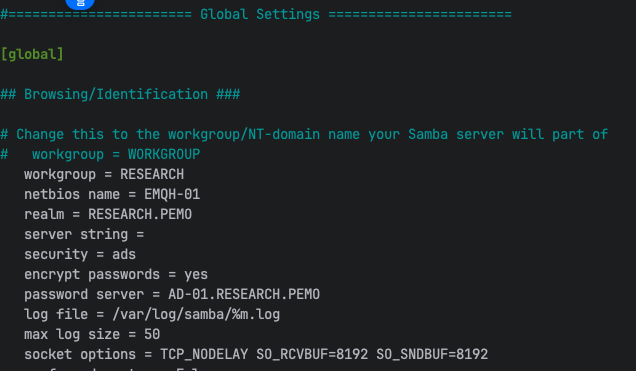    
    2. Start and enable the **Samba** service using the following command:   
       ```shell
       sudo systemctl enable --now smbd
       ```
    3. Join the machine to active directory domain using the following command:  
       ```shell
       sudo net ads join -S AD-01.RESEARCH.PEMO -U <user_in_ad_domain>
       ```
       **NOTE:** **<user_in_ad_domain>** is a user who has privileges in the AD domain to add a computer.  
    4. Start and enable the **winbind** service using the following command:  
       ```shell
       sudo systemctl enable --now winbind
       ```
       Verify that **winbind** service established a connection to the active directory domain by running 
       the command below:  
       ```shell
       sudo wbinfo -u
       ```
       **NOTE:** This command will return a list of users from the domain that is connected via **winbind**.  

    5. Verify AD login acceptance into the machine by logging out and logging in with an AD account.   
       Use the following command for reference:  
       ```shell
       ssh <user_in_ad_domain>@emqh-XX.research.pemo
       ```
21. Install **SentinelOne** cybersecurity software.     
    
    > The following sub steps will explain how to install **SentinelOne** by using a NAS (network attached storage) 
      device, then accessing the installation files on the NAS.  
    
    1. Check that the latest **SentinelOne GA Version** is on the **scada** share drive using the following path:  
       
       > /Volumes/scada/program_install_files/sentinel_one  
      
       See the image below for finding the latest packages using the **SentinelOne Web Management Console**:   
       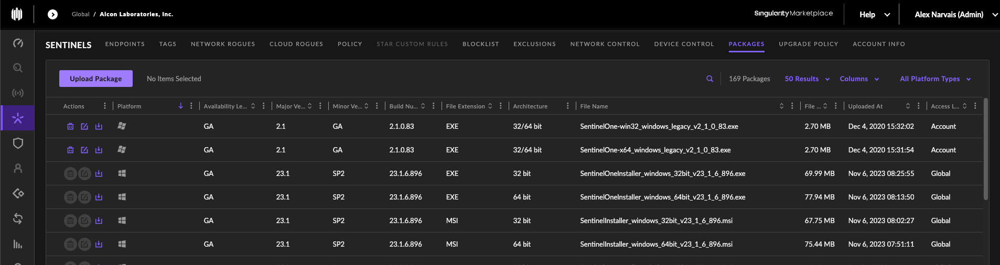   
    
    2. Make note and verify the site token for the site that the machine will join, the site token for a site can be found using
       the following image for reference, click the site to find the site token:  
          
    3. Install the network file system packages if not already installed using the following command:   
       ```shell
       sudo apt install nfs-common -y
       ```
    4. Create a NFS directory on the local machine to share using a similar command to the following:  
       ```shell
       sudo mkdir -p /mnt/scada/nas
       ```
    5. Check that the correct NFS share is available on the NFS server using a similar command to the following:  
       ```shell
       showmount -e cnas-01.research.pemo
       ```
       The following image will show the NFS shares available, from issuing the above command:  
       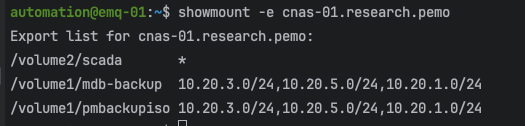   
       If the NFS share is not available, then check the following on the NAS:  
       - Ensure the share folder is created.  
       - Check the location of the share folder.  
       - Check the NFS permission rules.

    6. Mount the external NFS share on machine using a similar command to the following:  
       ```shell
       sudo mount -t nfs cnas-01.research.pemo:/volume2/scada /mnt/scada/nas
       ```
    7. Allow full permissions (read, write, execute) for the owner, group and others using a similar command to the following:  
       ```shell
       sudo chmod 777 /mnt/scada/nas
       ```
    8. Change directories to the location where the files and shell script are located using a similar command to the following:  
       ```shell
       cd /mnt/scada/nas/program_install_files/sentinel_one
       ```
    9. Once in the **SentinelOne** directory execute the shell script **sentinelone_linux_agent_install.sh** using the following command:  
       ```shell
       sudo ./sentinelone_linux_agent_install.sh
       ```
       **NOTE:** Ensure that the latest packages from **Step 22.1** are in the directory and that the shell script 
       contains the correct path to the latest package and site token (with respect to the site that the machine will join).   
       Use the following command to open the shell script, if necessary:  
       ```shell
       sudo nano sentinelone_linux_agent_install.sh
       ```
    10. Open up the **SentinelOne** web management console and verify the machine joined the Sentinels endpoint list, check the image below:  
          
22. Repeat **Steps 1–21** above for every EMQX HAProxy server node created.  
23. Jump to **Step 5** in the [EMQX HAProxy Main Content Steps](#emqx-haproxy-main-content-steps) section.  