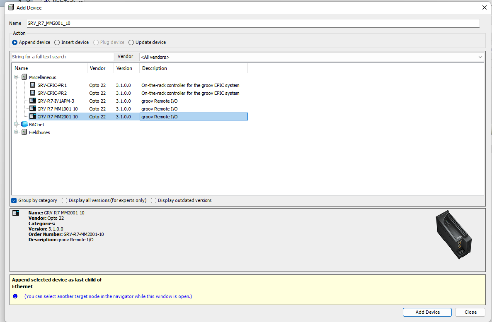
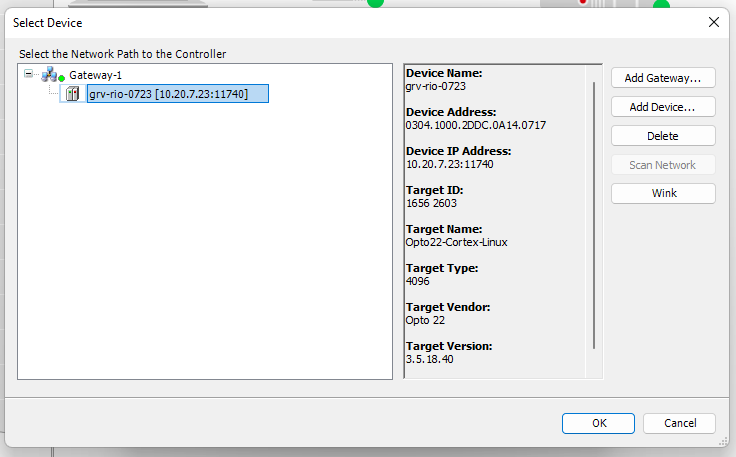
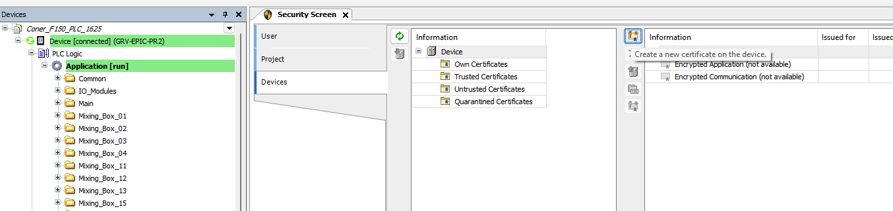
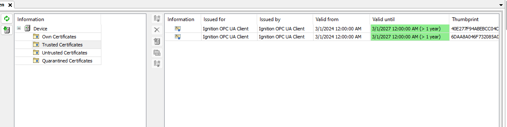

# OPTO 22 GROOV EPIC/RIO Controller Setup
This document will assist will setting up the GROOV EPIC/RIO using the [Main Content](#main-content) section topics.
___
## Main Content
1. [GROOV Manage Setup](#groov-manage-setup)
2. [GROOV RIO/EPIC Setup In CODESYS](#groov-rioepic-setup-in-codesys)
3. [CODESYS IGNITION OPU UA Client/Server Setup](#codesys-ignition-opu-ua-clientserver-setup)
4. [Configuring Secure Shell Access](#configuring-secure-shell-access)  
___  
## GROOV Manage Setup
1. Open a web browser and acess the **GROOV RIO/EPIC** by one of the following methods:  
   1. If the network that the device is connected to uses DHCP then access the device by the DHCP leased IP address
      or the default hostname that's listed on the information label of the device.  
   2. If the network doesn't use DHCP then install the **groov Find** application to find the device and assign it
      a static IP address, using the following link:
     
      https://www.opto22.com/support/resources-tools/downloads/groovfind-exe  

2. Navigate the to **Network** page and update the network configuration.  
   1. Path to configure network settings:  
         > Network/Configure
   2. Make the hostname in the following format:  
         > grv-<rio_OR_epic>-<IP_Octet3><IP_Octet4>  
        EX1: If device is RIO with IP address 192.168.1.5 then `hostname = grv-rio-0105`  
        EX2: If device is EPIC with IP address 192.168.111.555 then `hostname = grv-epic-111555` 
         
   **NOTE:** Use two digit precision minimum for each IP Octet.  
   
   See the image below for reference:    
         
3. Navigate the to **Time** page and update the time setting.
   1. Path to configure time settings:   
         > System/Time  
   2. Set the Time Servers and Time Zone accordingly, see image below for reference:    
             
4. Back to [Main Content](#main-content)
___
## GROOV RIO/EPIC Setup In CODESYS
1. Create a New Standard Project from the Codesys IDE.   
     

2. Select a programmable device and the program language for the default Main Task.  
     
3. Copy the **Composite Types** folder to the **Application View** that contains all the custom DUTs (Data Unit Type) 
   and POUs (Program Organization Unit).
   The **Composite Types** folder can be copied from another project or from the NAS,
   ensure that the folder has the latest DUTs and POUs before copying.  
   See the image below for reference:  
      
4. Add an Ethernet Adapter using the **Devices View (device tree)**:  
   1. Right-Click and add the device.  
         
   2. Select **All vendors** from the Vendor dropdown and add an **Ethernet Adapter**.  
        
   3. Add a device to the Ethernet adapter.  
         
   4. Add the GROOV EPIC/RIO as the device. 
      
5. Configure the I/O on GROOV EPIC/RIO using the **Devices View (device tree)**:  
   1. Plug a device for each empty slot of the GROOV EPIC/RIO by right-clicking on the device and selecting **Plug Device**.  
     
   2. Select the signal type or IO module for each empty slot that's being plugged.  
    
6. License the Codesys Runtime Engine on the EPIC/RIO
   1. Purchase a license using the following link:  
      https://www.opto22.com/products/product-selector?c1=32&c2=34
   2. After purchasing the license, activate the license to retrieve a Codesys Ticket ID using the following link:  
      https://www.opto22.com/my-opto/manage-groov/activate-groov
   3. From the tools tab select License Manager, see the image below for reference:  
      
   4. From the **Select Target** prompt select **Device**, see the image below for reference:  
      
   5. From the **Select Container** prompt select **Soft container**, see the image below for reference:  
        
   6. From the **Select Device** prompt select the network path to the controller by either scanning for the device
      or adding the device then selecting OK, see the image below for reference:   
         
   7. Select the **Install Licenses** button and activate the license using the **Codesys Ticket ID** from **Step 5.2**:  
         
   8. Verify that the runtime was licensed by checking the **Device Log**, see image below for reference:  
           
7. Follow the sub steps below to download a working program to the device.
   1. Compile the code to check for errors by using the **Generate Code** tool from the **Build Tab**. 
   2. Select the **Communication Settings** section from the **Device View Page** and add a device to the **Gateway** 
      by scanning the network with the **Scan Network** button or manually entering the IP address of the device 
      and pressing **enter**.  
      See the image below for reference:    
          
   3. Select the **Ethernet Adapter** that was added from **Step 4** and set the network interface to the local host 
      by using the **Browse** button.   
      See the image below for reference:  
           
   4. Select **Login** from the **Online Tab** to login and download to the device.  
      See the image below for reference:  
            
8. Back to [Main Content](#main-content)  
___
## CODESYS IGNITION OPU UA Client/Server Setup
The Symbol Configuration object will be added to the CODESYS project to expose tags to the CODESYS OPC UA Server and
allow Ignitions OPC UA Client to connect and read/write tags.   
Perform the following to add a **Symbol Configuration** object in the offline mode:  
1. Right-click on the **Application** node in the left navigation tree and add a **Symbol Configuration** object. 
   See the image below for reference:  
   
2. Click into the **Symbol Configuration** object and open the **Settings** dropdown:  
   1. Check the **Support OPC UA Features**.  
   2. Select **Optimized Layout** under the **Configure Synchronisation with IEC task...** dropdown.   
   See the image below for reference:   
     
3. Select the GLOBAL (GVL) or Program tags you want to expose and select **Build**.    
   See the image below for reference:   
     
4. Download the new configurations.
5. Create a Codesys OPC UA Server certificate on the device, using the following sub steps:  
   1. Launch the **Security Screen** from the **View Tab**. 
      See the image below for reference:  
           
   2. Select the **Devices Tab** and click the **Refresh Button** to check the available list of devices.  
      See the image below for reference:   
          
      **NOTE:** If the **Devices Tab** isn't shown when launching the **Security Screen** then
                the **CODESYS Security Agent Package** will need to be installed using the 
                **CODESYS Installer Application** and then selecting the Browse Tab from the Add-ons section.   
      See the image below for reference:    
         
   3. Generate a certificate for the **OPC-UA Server**, **Encrypted Communication**, and **Encrypted Application**,
     see image below for reference:  
         
   4. Set the **Key length = 4096** and **Validated period = max days (3650)**, see image below for reference:  
      
   5. Make note of the validation period for each certificate as in the image below:    
         

6. Goto the Ignition Gateway where the OPC connection will be created, and select **Create new OPC Connection**.
   1. Use the following path after accessing the Ignition Gateway:  
   
      >  **Config/OPC Client/OPC Connections**   
      
      See image below for reference:   
         
   
   2. Configure the following connection type:  
   
      > Endpoint URL = opc.tcp://IPv4_Address:4840/discovery     
        Security Policy and Mode Configuration = {name = opc.tcp://IPv4_Address:4840/discovery, Policy = Basic256Sha256, Mode = SignAndEncrypt}   
      
      See the image below for reference:   
      
      
      **NOTE:** The connection will fault out because the certificate isn't trusted yet in CODESYS.   
   
7. Goto the CODESYS IDE and trust the **Ignition OPC UA Client** certificate using the following sub steps:  
   1. Check that the **Ignition OPC UA Client** certificate is visible under the **Quarantined Certificates** folder
      using the following path:  

      > **View/Security Screen/Devices/Device/Quarantined Certificates**  
      
      See the image below for reference:    
         
   
   2. Move the **Ignition OPC UA Client** certificate from **Quarantined Certificates** to the **Trusted Certificates**
      folder.
      If there exist an **Ignition MASTER/BACKUP** pair, then two certificates will need to be **Trusted**. 
   
      See the image below that shows two trusted certificates for **Ignition MASTER/BACKUP** pair:    
         
   
   **NOTE:** If the certificates are not being quarantined in the CODESYS IDE, then it's possible 
             that a power cycle will need to be performed on the GROOV RIO/EPIC.   
   
8. Goto the Ignition Gateway and trust the CODESYS OPC UA Server certificate, using the following sub steps:  
   1. Navigate to the **Client Security** page and trust the **Quarantined Codesys OPC UA Server Certificate** using 
      the following path:   
      
      > Config/OPC UA/Security/Client Tab     

      See the image below for reference:    
           
   **NOTE:** If there exist an **Ignition MASTER/BACKUP pair**, then goto each gateway and **Trust** the certificate.  
   2. Verify the OPC client connection was established to the CODESYS OPC UA Server, using the following path:  
    
      > Config/OPC Client/OPC Connections  
      
      See the image below for reference:    
        
9. Back to [Main Content](#main-content)
___
## Configuring Secure Shell Access
1. Purchase a shell license using the following link:  
   https://www.opto22.com/products/product-selector?c1=32&c2=34
2. After purchasing the license, activate the license to enable access to the shell download license file,
   using the following link:  
   https://www.opto22.com/my-opto/manage-groov/activate-groov  
3. After the activation, a **Download License File** button will appear to enable the license file to be downloaded.   
   See the image below for reference:      
     
4. Goto the **GROOV Manage** web application and navigate to the **License** page and upload the license from **Step 3**
   using the following path:  
   
   > System/License
   
   See the image below for reference:     
   

5. Navigate to the **Shell** page and create an account to activate the server using the following path and credentials:    
   
   1. Path

      > System/Shell

   2. Credentials    
   
      > username = automation      
        password = <one_extra_rich_capital_cat>   
   
   See the image below for reference:     
       
6. Verify the server is running and access the shell using SSH.
   1. Server Running Status:  
           
   2. Linux Command to access shell using SSH
      
      > ssh automation@<IPV4_Address or Hostname>
      
      **NOTE:** After initial connection a prompt will appear asking for the password.  
7. Back to [Main Content](#main-content) 
___