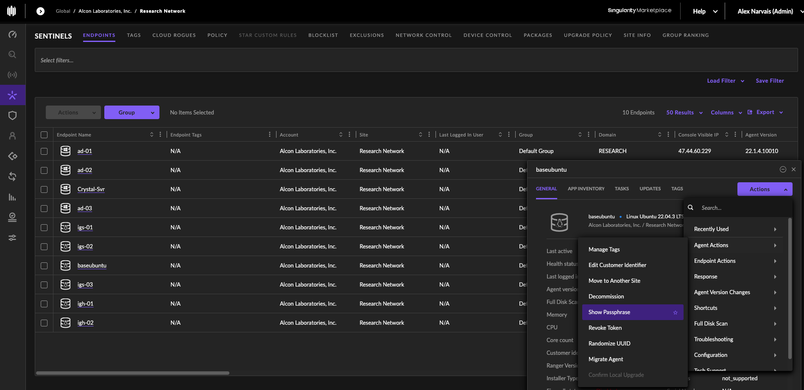
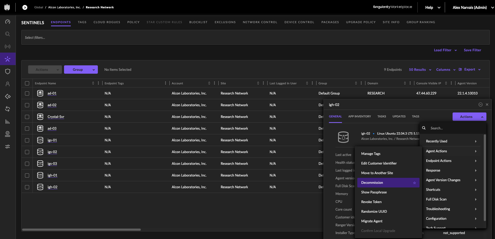

# Installing, Updating, and Removing SentinelOne
Ensure that the latest package is downloaded with respect to the OS platform the package will be installed on. 
The site token will register the machine to the correct site, so verify the correct site token matches the site the machine
will join before installing SentinelOne. 
___
## Linux Machines Install
1. The latest SentinelOne package can be verified and downloaded from the web management console:  
     
2. The site token can be viewed and copied by clicking on the correct site:  
     
3. Install the network file system packages if not already installed using the following command:
   ```shell
   sudo apt install nfs-common
   ```
4. Create a NFS directory on the local machine to share using a similar command to the following:
   ```shell
   sudo mkdir -p /mnt/scada/nas
   ```
5. Allow full permissions (read, write, execute) for the owner, group and others using a similar command to the following
   ```shell
   sudo chmod 777 /mnt/scada/nas
   ```
6. Check that the correct nfs share is available on the NFS server using a similar command to the following:
   ```shell
   showmount -e cnas-01.research.pemo
   ```
7. Mount the external NFS share on machine using a similar command to the following:
   ```shell
   sudo mount -t nfs cnas-01.research.pemo:/volume1/scada /mnt/scada/nas
   ```
8. Change directories to the location where the files and shell script are located using a similar command to the following
   ```shell
   sudo cd /mnt/scada/nas/..../....
   ```
9. If denied access to the nfs share then change owner of the directory using a similar command to the following:
   ```shell
   sudo chown <user or user:group> /mnt/scada/nas
   ```
10. Open up the SentinelOne web management console and verify the machine joined the site:
      

      
___
## Windows Machines
Will update this section at a later time.
___
## Uninstalling SentinelOne Agent
1. Linux Machines:
   1. Use the following methods to uninstall SentinelOne:
      ```shell
      sudo /opt/sentinelone/bin/sentinelctl control uninstall --passphrase "string" [--output] [--unquarantine]
      ```
      Replace the passphrase which can be found under the endpoint name using the web management console 
      with the `string` word but remember to keep the double quotes, see the image below for finding the passphrase:  
        
      Uninstall from the web management console using the following image as reference:  
        
   2. If the machine is not removed (decommissioned) from the Sentinels Endpoint List then remove it manually using the 
      web management console refer to the image below for reference:  
      
2. Windows Machines:  
      