# Rockwell Automation Virtual Machine Creation and Setup
The following virtual machine(s) will be created using the **PROXMOX** Hypervisor Type 1 Software.   
___
1. Access the Proxmox hypervisor web interface using a web browser and enter the following url in the specified format:  
    **https://PROXMOX-Server-IP-Address:8006/**

2. Right-click on the **PROXMOX** node where the virtual machine will be created and start the VM creation process:  
   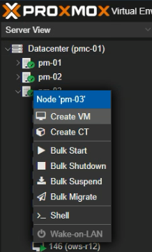

3. Configure the VM configuration settings:  
   1. **General:**  
      1. Name = **rockwell**  
      2. Start at boot = **True**  
      3. All Other Settings = **Default**  
      **NOTE 1:** If some settings are not visible, then set **Advanced checkbox** = **True** and the remaining settings
      should be visible.  
      **NOTE 2:** See image below for **General** settings summary:    
      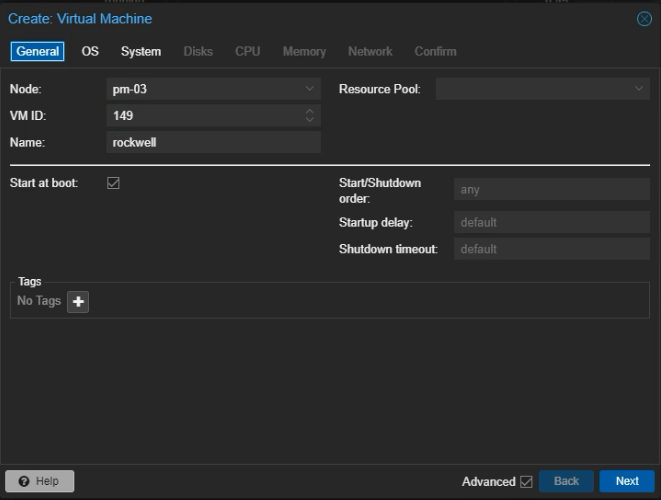     
   
   2. **OS:**  
      1. Select **Use CD/DVD disc image file(iso)**:  
         1. Storage = **backupiso**  
         2. ISO image = **Windows11.iso**   
      **NOTE 1:** If a Windows 11 ISO isn't available, then download the last ISO from
      [Microsoft Windows Software Download Page](https://www.microsoft.com/software-download/windows11)   
      2. Guest OS Settings:  
         1. Type = **Microsoft Windows**  
         2. Version = Latest version from the dropdown. In this setup **11/2022** is chosen.  
         3. Add additional drive for VirtIO drivers = **True**  
            1. Storge = **backupiso**  
            2. ISO image = **virtio-win-X.iso**, where X = the latest VirtIO drivers  
      **NOTE 2:** The latest VirtIO drivers can be downloaded from 
      [Windows VirtIO Drivers Page](https://pve.proxmox.com/wiki/Windows_VirtIO_Drivers)  
   
      **NOTE 3:** New ISO images will need to be uploaded to the **PROXMOX backupiso** storage, using the following path:  
      > pm-xx/backupiso/ISO images - xx is PROXMOX node instance  

      **NOTE 4:** See image below for **backupiso** storage upload location:    
               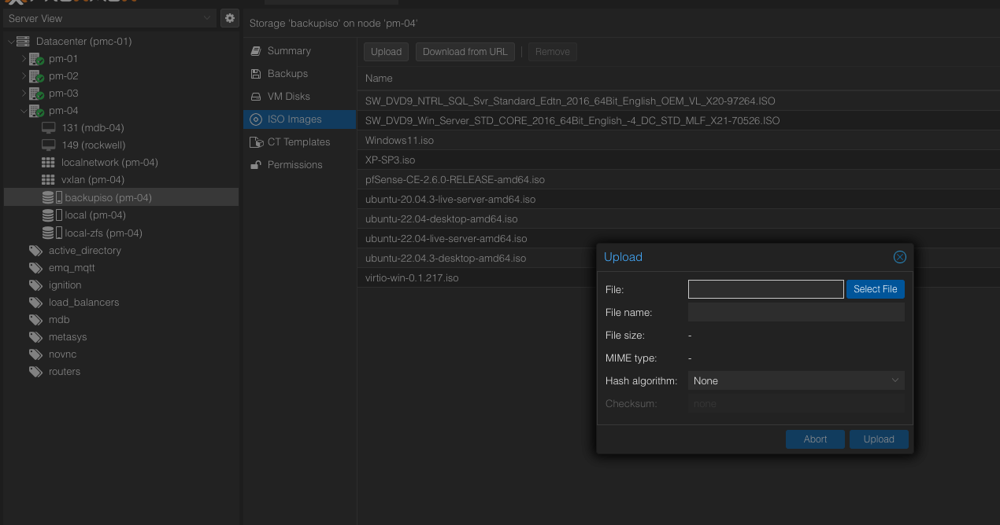   
   
      **NOTE 5:** See image below for **OS** settings summary:  
               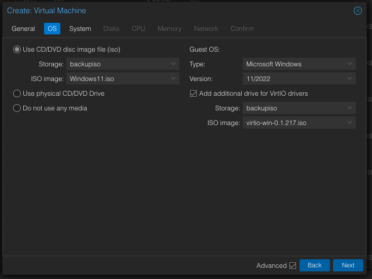
   
   3. **System:**  
      1. Graphic Card: = **Default** 
      2. Machine = **q35** 
      3. Firmware BIOS = **OVMF (UEFI)**
      4. Add EFI Disk = **True**
      5. EFI Storage = **local-zfs**
      6. SCSI Controller = **VirtIO SCSI single**
      7. Qemu Agent = **True**
      8. Add TPM = **True**
      9. TPM Storage = **local-zfs**
      10. Version = latest version, in this setup **v2.0** is chosen
      11. All Other Settings = **Default**  
   
      **NOTE:** See image below for **System** settings summary:  
                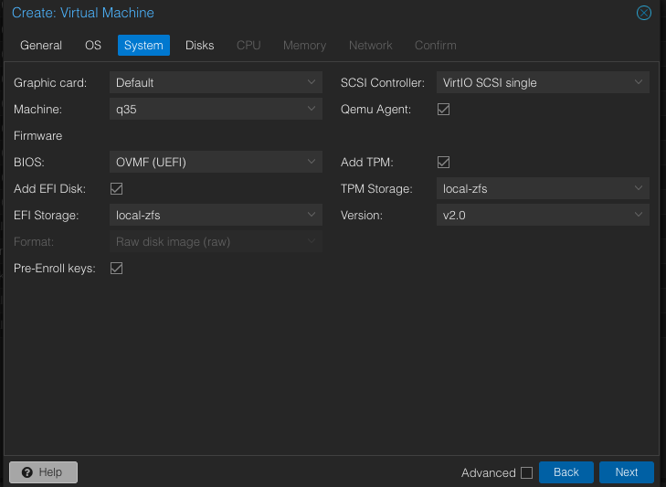  
   
   4. **Disks:**
       1. Bus/Device = **SCSI-0**
       2. Storage = **local-zfs**
       3. Disk size (GiB) = **1024**
       4. Backup = **True**
       5. All other settings = **Default**  

      **NOTE:** See image below for **Disks** settings summary:  
                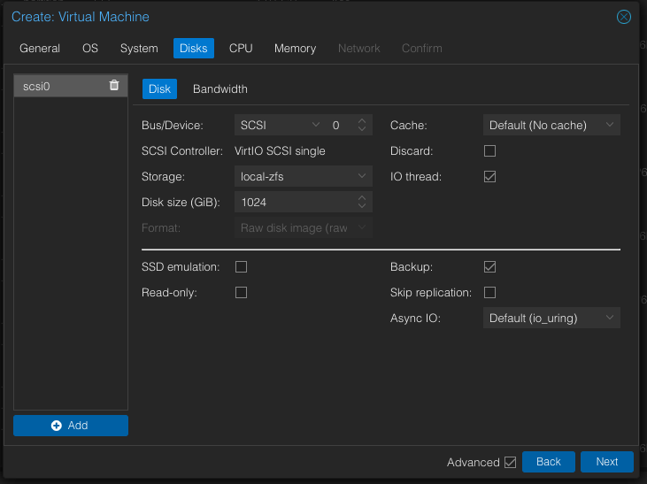    
   
   5. **CPU:**
      1. Sockets = **2**
      2. Cores = **4**
      3. Type = **x86-64-v2-AES**
      4. All other settings = **Default**
   
      **NOTE:** See image below for **CPU** settings summary:  
                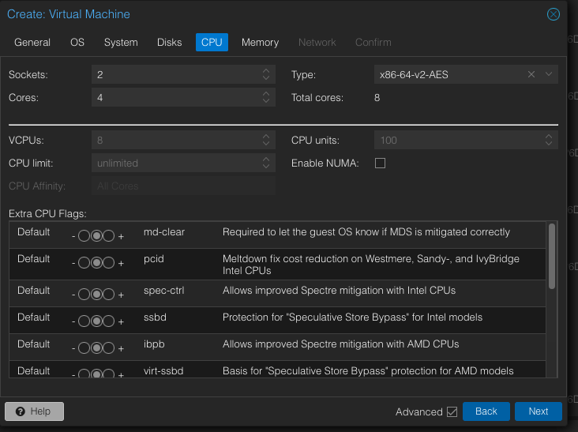   
   
   6. **Memory:**
      1. Memory (MiB) = **16384**
      2. Minimum Memory (MiB) = **1024**
      3. Ballooning Device = **True**
      4. All other settings = **Default**  
   
      **NOTE:** See image below for **Memory** settings summary:  
                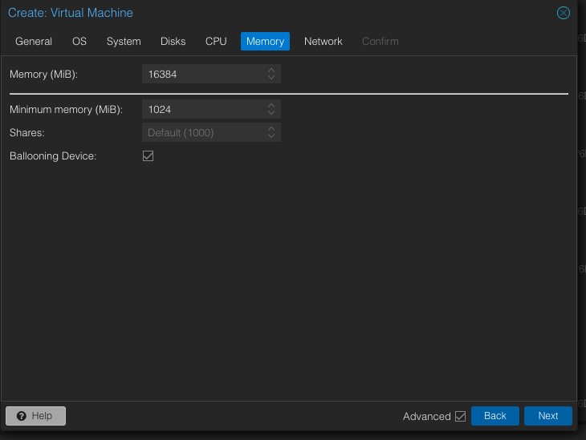   

   7. **Network:**
      1. No network device = **False**
      2. Bridge = **vmbr0** 
      3. Firewall = **True**
      4. Disconnect = **False**
      5. Model = **Intel E1000** 
      6. All other settings = **Default**   
   
      **NOTE:** See image below for **Network** settings summary:  
                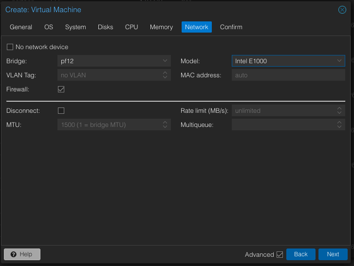   
   
   8. **Confirm:** Review the applied settings then select **Finish**, if all the settings are correct.  

4. Start the virtual machine using the **Start** button, when the VM process is complete.  
5. During the **Windows OS Setup** set the following settings:
   1. Language to install = **English (United States)**
   2. Time and currency format = **English (United States)**
   3. Keyboard or input method = **US**
   4. Select **Install Now**
   5. Select **I dont have a product key**, this will be applied during the Windows Desktop Setup. 
   6. Select **Windows 11 Pro X64**
   7. Install the VirtIO drivers using the **Custom: Install Windows only (advanced)** option
      1. Select **Load driver** to find the VirtIO drivers
      2. Select **OK** once the Load driver prompt appears
      3. Select **Next** after selecting the **Redhat SCSI VirtIO** driver for **Windows 11 amd64**, 
         see the below image for reference:   
         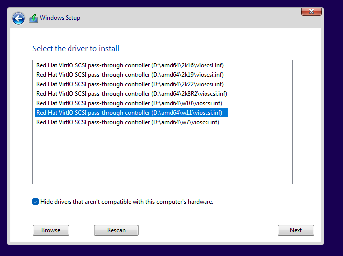     
      4. Select **Next** after selecting the disk drive where Windows 11 will be installed, this is the disk drive that 
         was configured during the **Disk** settings of the VM creation from **Step 3.4.c**.  
         See image below for reference:     
         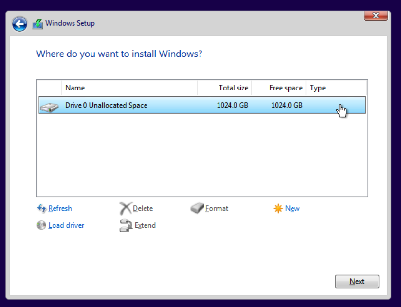     
6. During the **Windows Desktop Setup** set the following settings:
   1. Country or Region = **United States**
   2. Keyboard Layout = **US**
   3. Second keyboard layout = **Skip** 
   4. Once internet connection is established, select **Next**
   5. Set the device name to **rockwell**
   6. Select **Next** after selecting **Set up for work or school**
   7. Once the **Sign In** prompt appears, select **Sign-in options/domain-join instead** and set the following 
      credentials:  
      
       > user = Automation  
        password = <one_extra_rich_capital_cat>  

   8. Select three random security questions to all have an **answer = alcon**
   9. All Privacy Settings = **No**
7. Once the Windows 11 Desktop appears open **File Explorer** and navigate to the **VirtIO ISO** that was 
   mounted with the virtual CD-ROM/DVD drive of the VM and run the **virtio-win-gt-x64** and **virtio-win-guest-tools** 
   wizard installations.  
   See the image below for reference:   
   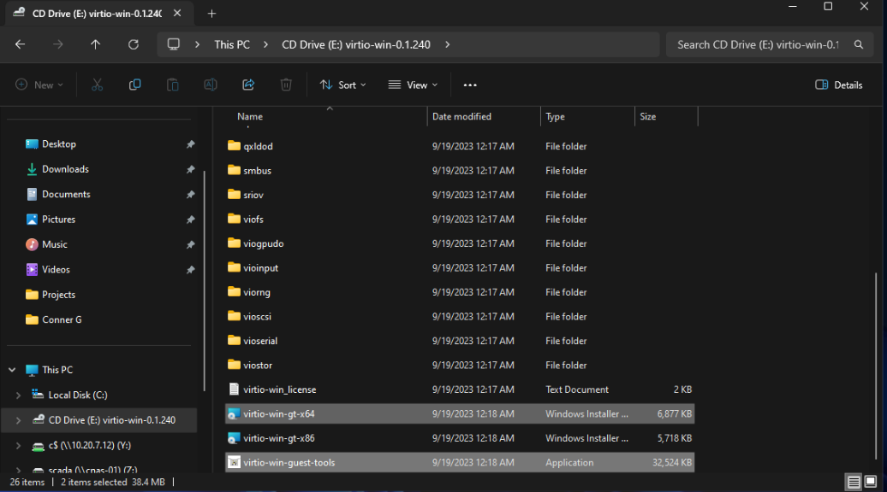     
8. Shutdown the VM and perform the following from the **Hardware** section of the VM:  
   1. Remove all **CD/DVD Drives**, see the following image for reference:  
      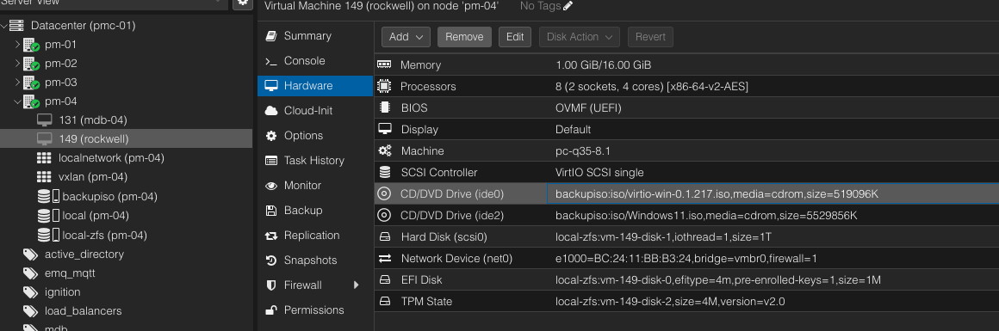   
   2. Change the **Model** of the network device to **VirtIO (paravirtualized)**, 
      see the following image for reference: 
      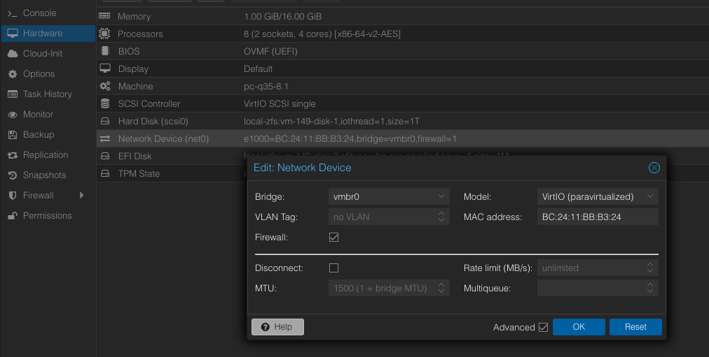    
9. Start the VM and activate Windows under the **System** settings once the desktop appears.
10. Check for any Windows Updates using the following path:  

   > Settings/Windows Update  

11. Join the computer to the research.pemo domain:  
    1. Using the following path to set the domain settings:
       
       > Settings/System/About/Domain or workgorup

    2. Under the **Computer Name** tab, select the **Change** button and type the **research.pemo** domain and 
       enter a administrator registered user in the domain to apply the changes.  
       **NOTE:** See image below for reference:   
                 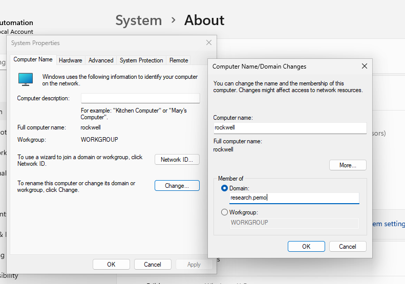    
    3. If the computer was successfully joined to the domain, then a welcome prompt will appear, see the following 
       confirmation image below for reference:    
       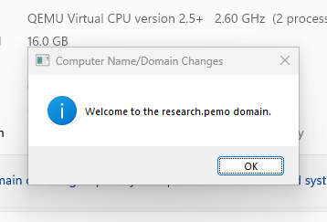     
    4. Reboot the VM to apply the new changes.   
12. Goto any research active directory virtual machine (ad-01, ad-01, ad-03) under the relevant PROXMOX node
    and create an autologin user.  
    1. Launch Microsoft Server Manager
    2. Under the path **Tools/Active Directory Users and Computers/Autologin Users** create a new user with the 
       following credentials:  

       > user = rockwell  
         password = <one_extra_rich_capital_cat> 

    **NOTE:** See image below for reference:    
              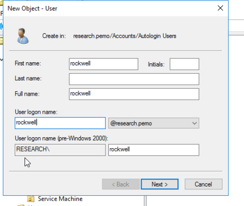 

13. Go back to the **rockwell virtual machine** and map the **CNAS-01** NFS share drive:  
    1. Launch the **File Explorer**, highlight **This PC**, right-click and select **Map network drive**.
    **NOTE:** See image below for reference:    
              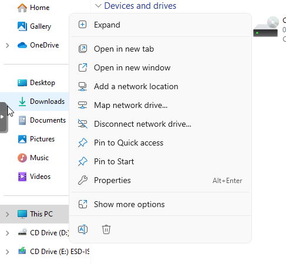   
    2. Once the Map Network Drive prompt appears type **\\cnas-01\scada** into the **Folder** field.
    3. After mapping the cnas-01 scada drive, access the **autologon** folder and drag the **Autologon** reg file 
       onto the **rockwell** desktop. 
    4. Right-click and edit the **Autologon** reg file with the autologin user credentials from **Step 12.2**, see the 
       image below for reference:   
       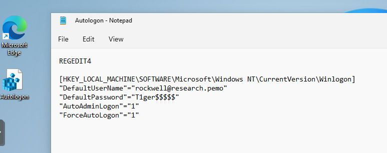      
    5. After saving the file, run the file and reboot the VM to verify the autologin process. 
    6. Delete the **Autologon** reg file from the desktop.
14. Install **SentinelOne** cybersecurity software.   

    > The following sub steps will explain how to install **SentinelOne** by using a NAS (network attached storage) 
      device, then accessing the installation files on the NAS.  

    1. Check that the latest **SentinelOne** package is on the research scada share drive using the following path:  
       
       > /Volumes/scada/program_install_files/sentinel_one  
       
       See the image below for finding the latest packages using the **SentinelOne Web Management Console**:   
       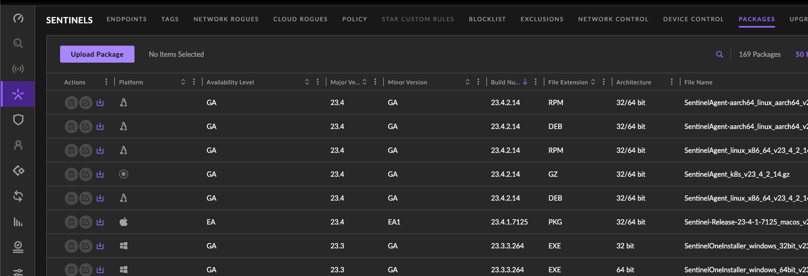   
    2. Run the **install_sentinel_64bit_research** windows batch file from the previous **Step (14.1)** directory.
    3. Access the **SentinelOne Web Management Console** and verify the machine has joined 
       the **Research Network Site**.
15. Change the power settings for the screen and sleep power mode to **Never**, using the following path:  
    
    > Settings/System/Power

    **NOTE:** See the image below for reference:   
              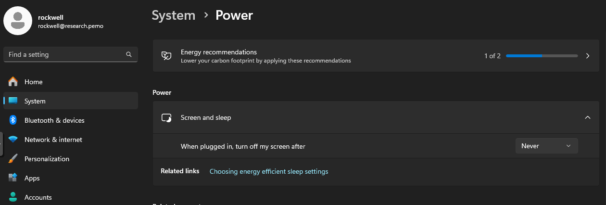   
16. Start the Rockwell Automation Studio 5000 download process using one of the following methods:  
    1. Access the **rockwell_automation** directory on the **CNAS-01 Scada** share drive using the following path:   
       > /Volumes/scada/program_install_files/rockwell_automation  
    2. Open a web browser, access the 
       [Rockwell Automation Compatibility & Downloads](https://compatibility.rockwellautomation.com/Pages/Home.aspx)
       page, sign in, and download the install files by **Serial Number**.  
    **NOTE:** Download Studio 5000 from **Version 16 - Latest Version**
17. Download any other necessary software applications such as the following:  
    1. PyCharm
    2. Angry IP Scanner
    3. Python
    4. Google Chrome
    5. Etc...
18. Map any other useful network drives using the sub steps from **Step 13**.  
19. Adjust the display resolution if necessary, from the BIOS OVMF (UEFI) by restarting the VM and 
    continuously pressing the **esc** key.   
    Use the BIOS if the display resolution isn't able to be changed from the Windows 11 system settings.  
    See the following path to access the display resolution setting in the BIOS:   

    > Device Manager/OVMF Platform Configuration/Change Preferred

    **NOTE:** See the image below for reference:    
    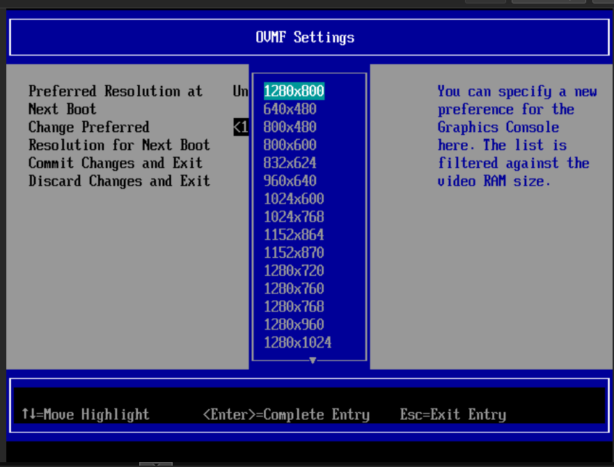  
